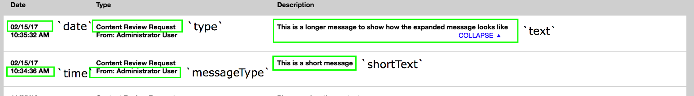

<div id="page">
<div id="main" class="aui-page-panel">
<div id="main-header">
<div id="breadcrumb-section">
1.  [Developer](index.html)
2.  [Documentation](Documentation_31429504.html)
3.  [Cookbook](Cookbook_31429528.html)

</div>
**Developer : Creating custom notifications for Flex Workflow**

</div>
<div id="content" class="view">
<div class="page-metadata">
Created by Dominika Kurek on Feb 15, 2017

</div>
<div id="main-content" class="wiki-content group">
<div class="contentLayout2">
<div class="columnLayout two-right-sidebar"
data-layout="two-right-sidebar">
<div class="cell normal" data-type="normal">
<div class="innerCell">
To create a custom notification you have to provide two plugins in the
`flex-workflow` bundle, one for the `notificationsPopupView` and second
for the `notificationIndicatorView`.

We will start from creating a plugin for `notificationIndicatorView`
which is responsible for displaying a text in the notification bar (this
green stripe in the bottom when you get new notification)

We have to start from adding dependencies in yui.yml (placed
in `./Resources/config/yui.yml`): 

<div class="code panel pdl" style="border-width: 1px;">
<div class="codeContent panelContent pdl">
``` {.sourceCode .brush:}
mb-notificationmessagecreatorplugin:
    requires: ['plugin', 'ez-pluginregistry']
    dependencyOf: ['fw-notificationindicatorview']
    path: %mybundle.public_dir%/js/plugins/mb-notificationmessagecreatorplugin.js
```

</div>
</div>
Now we can create our plugin (as we declared in the yui.yml, we need to
create it in `./js/plugins`), it will be stored in a file named
`mb-notificationmessagecreatorplugin.js`: 

<div class="code panel pdl" style="border-width: 1px;">
<div class="codeContent panelContent pdl">
``` {.sourceCode .brush:}
YUI.add('mb-notificationmessagecreatorplugin', function (Y) {
    'use strict';

    var PLUGIN_NAME = 'mbNotificationMessageCreatorPlugin';

    /**
     * Add the notification message creator
     *
     * @module mb-notificationmessagecreatorplugin
     */
    Y.namespace('mb.Plugin');

    /**
     * @namespace mb.Plugin
     * @class mbNotificationMessageCreator
     * @constructor
     * @extends Plugin.Base
     */
    Y.mb.Plugin.NotificationMessageCreator = Y.Base.create(PLUGIN_NAME, Y.Plugin.Base, [], {
        initializer: function () {
            var notificationIndicatorView = this.get('host');

            /**
             * This will add a message creator to the `notificationIndicatorView`.
             * In the public method `addNotificationMessageCreator` we have to provide:
             * 1. The notification type.
             * 2. The callback to be invoked to create the message in the notification bar.
             */


           notificationIndicatorView.addNotificationMessageCreator('myNotificationType',
 this._createNotificationMessage.bind(this));
        },

        /**
         * Creates a notification message.
         *
         * @method _createNotificationMessage
         * @protected
         * @param notification {Object} the notification
         * @return {String}
         */
        _createNotificationMessage: function (notification) {
            /**
             * In this method we have to return a string which will be displayed in the notification bar.
             * To this method is passed the notification object provided from backend.
             * In this tutorial we assume that the message is in object `data`.
             */
            return notification.data.message;
        },

    }, {
        NS: PLUGIN_NAME
    });

    Y.eZ.PluginRegistry.registerPlugin(
         Y.mb.Plugin.NotificationMessageCreator, ['notificationIndicatorView']
    );
});
```

</div>
</div>
Now we can create a plugin for the `notificationsPopupView`, it will be
responsible for creating a proper notification struct, again we start
from creating dependency in yui.yml: 

<div class="code panel pdl" style="border-width: 1px;">
<div class="codeContent panelContent pdl">
``` {.sourceCode .brush:}
mb-notificationstructparserplugin:
    requires: ['plugin', 'ez-pluginregistry']
    dependencyOf: ['fw-notificationspopupview']
    path: %mybundle.public_dir%/js/plugins/mb-notificationstructparserplugin.js
```

</div>
</div>
And we create a plugin named `mb-notificationstructparserplugin`:

<div class="code panel pdl" style="border-width: 1px;">
<div class="codeContent panelContent pdl">
``` {.sourceCode .brush:}
YUI.add('mb-notificationstructparserplugin', function (Y) {
    'use strict';

    var PLUGIN_NAME = 'mbNotificationStructParserPlugin',
        TIMESTAMP_MULTIPLIER = 1000;

    /**
     * Add the notification struct parser
     *
     * @module mb-notificationstructparserplugin
     */
    Y.namespace('mb.Plugin');

    /**
     * @namespace mb.Plugin
     * @class mbNotificationStructParser
     * @constructor
     * @extends Plugin.Base
     */
    Y.mb.Plugin.NotificationStructParser = Y.Base.create(PLUGIN_NAME, Y.Plugin.Base, [], {
        initializer: function () {
            var notificationsPopupView = this.get('host');

            /**
             * This will add notification parser to the `notificationsPopupView`.
             * In the public method `addNotificationStructParser` we have to provide:
             * 1. The notification type.
             * 2. The callback to be invoked to create the proper notification struct.
             */
            notificationsPopupView.addNotificationStructParser('myNotificationType', this._createNotificationStruct.bind(this));
        },

        /**
         * Creates a notification structure required to render notifications
         *
         * @method _createNotificationStruct
         * @protected
         * @param item {Object} notification data
         * @return {Object}
         */
        _createNotificationStruct: function (item) {
            var creationDate = new Date(item.created * TIMESTAMP_MULTIPLIER);

            /**
             * In this method we have to return an object with proper notification struct.
             * The proper struct looks like this:
             * {
             *     id: {Number} the notification id
             *     isPending: {Number} is notification pending (0 or 1)
             *     date: {String} the date of notification
             *     time: {String} the time of notification
             *     type: {String} the notification type
             *     messageType: {String} the type message
             *     link: {String} the url to redirect user on click (if omitted will only close popup)
             *     shortText: {String} the short description text
             *     text: {String} the long description text (if omitted only shortText will be displayed)
             * }
             */
            return {
                id: item.id,
                isPending: parseInt(item.isPending, 10),
                type: item.type,
                date: Y.Date.format(creationDate, {format: '%x'}),
                time: Y.Date.format(creationDate, {format: '%X'}),
                link: item.data.link,
                messageType: item.data.contentName,
                shortText: item.data.message,
                text: item.data.message
            };
        },
    }, {
        NS: PLUGIN_NAME
    });

    Y.eZ.PluginRegistry.registerPlugin(
         Y.mb.Plugin.NotificationStructParser, ['notificationsPopupView']
    );
});
```

</div>
</div>
Now we can clear cache (`php app/console --env=prod cache:clear`) and
our notification should be displayed properly. In the image below you
can check what is what in the notification struct:  

{.confluence-embedded-image
width="600px"}

</div>
</div>
<div class="cell aside" data-type="aside">
<div class="innerCell">
 

</div>
</div>
</div>
</div>
</div>
<div class="pageSection group">
<div class="pageSectionHeader">
**Attachments:**

</div>
<div class="greybox" align="left">
{width="8px" height="8px"}
[notification.png](attachments/33555728/33555726.png) (image/png)

</div>
</div>
</div>
</div>
<div id="footer" role="contentinfo">
<div class="section footer-body">
Document generated by Confluence on Mar 24, 2017 17:20

<div id="footer-logo">
[Atlassian](http://www.atlassian.com/)

</div>
</div>
</div>
</div>

