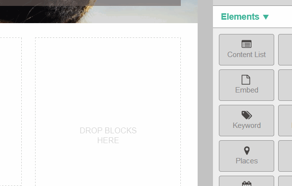
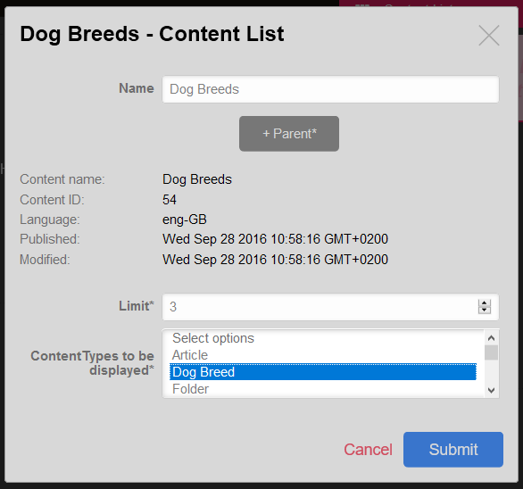
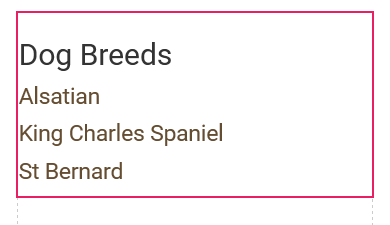
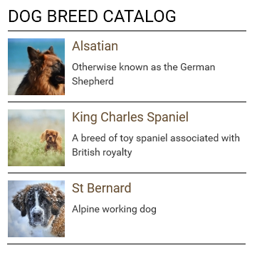
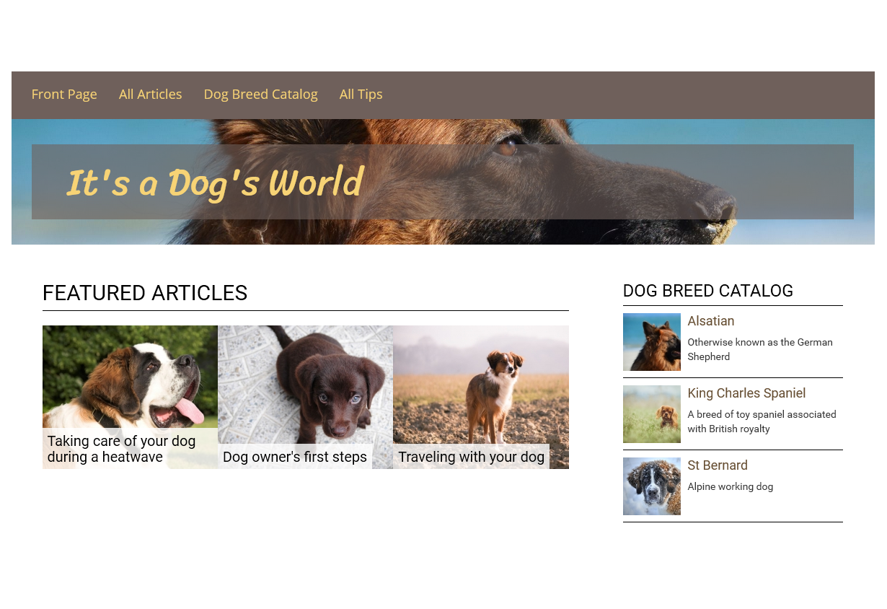
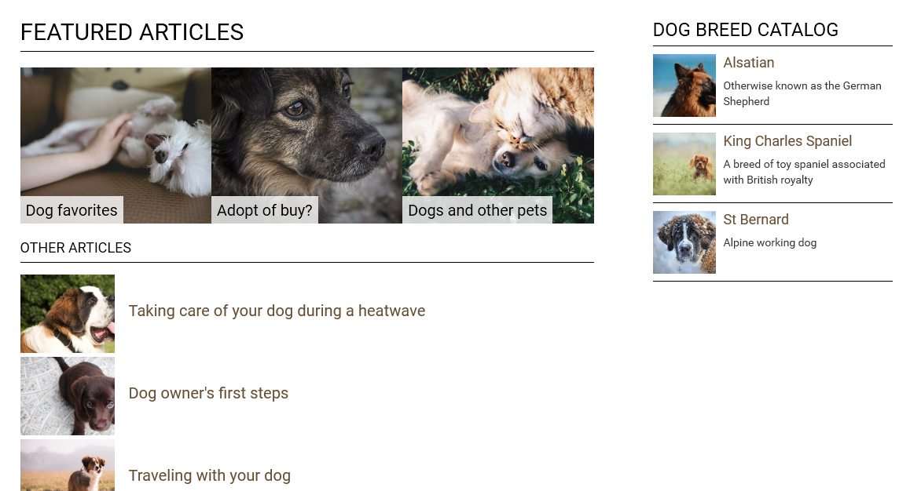

# Step 3 - Using existing blocks

You can find all files used and modified in this step on [GitHub](https://github.com/ezsystems/ezstudio-beginner-tutorial/tree/step3).

In this step you'll add a Content List Block and two Schedule Blocks and customize them.

In this step pay close attention to the order of tasks. If you overlook a configuration file and try to generate a Landing Page without it, the Landing Page may become corrupted in the database. You may then get a 500 error when trying to access it. If this happens, you should delete the page and create it again from scratch.

### Add Content List Block

At this point you can start adding blocks to the Landing Page. This is done in the Studio UI Edit mode by simply dragging the required block from the menu on the right to the correct zone on the page.

{.image-center height="250"}

Not all the blocks we have planned are available to you just yet, so let's start with the simplest one. Drag a Content List Block from the menu to the right column, click the (still empty) block and enter its settings. Here you give a name to the block and decide what it will display. Choose the Dog Breed Catalog folder as the Parent, select Dog Breed as the Content Type to be displayed, and choose a limit. In our case we'll display the first three Dog Breeds we have in our database.

{.image-center width="400"}

When you click Submit, you should see a preview of what the block will look like with the dog breed information displayed.

{.image-center width="300"}As you can see, the block is displayed using a very basic, unstyled template. Built-in blocks have default templates already included in the installation, and it's this one that is being used right now. But you can override it according to your needs, and add templates for new custom blocks that you create (which we'll do in the next step). Publish the page now and we'll start configuring the block.

First let's create an override template for the Content List block. Create a `blocks` folder under `app/Resources/views` and place the new template file in it:

**app/Resources/views/blocks/contentlist.html.twig**

```
<div>
    <h3 class="heading">{{ parentName }}</h3>
    
        <div class="content-list">
            
                <div class="content-list-item">
                    <div class="content-list-item-image">
                        {{ ez_render_field(content.content, 'photo', {
                            'parameters': {
                                'alias': 'content_list'
                             }
                        }) }}
                    </div>
                    <h4><a href="{{ path(content.location) }}">{{ ez_content_name(content.content) }}</a></h4>
                    
                        <div class="attribute-short-description">
                            {{ ez_render_field(content.content, 'short_description') }}
                        </div>
                    
                </div>
            
        </div>
    
</div>
```

Then we add a configuration that will tell the app to use this template instead of the default one. Go to the `layouts.yml` file that you created previously when preparing the Landing Page layout and add the following code:

**in app/config/layouts.yml**

```
blocks:
    contentlist:
        views:
            contentList:
                template: blocks/contentlist.html.twig
                name: Content List
```

This block should be placed at the end of the file, within the `ez_systems_landing_page_field_type` key. Watch your indentation!

One more thing is required to make the template work. The twig file specifies an [image alias](Images) – a thumbnail of the Dog Breed image that will be displayed in the block. To configure this image alias, open the `app/config/image_variations.yml` file and add the following code under the `image_variations` key (once again, mind the indentation):

**in app/config/image\_variations.yml**

```
content_list:
    reference: null
    filters:
        - {name: geometry/scaleheightdownonly, params: [81]}
        - {name: geometry/crop, params: [80, 80, 0, 0]}
```

Finally, we should add some styling to the block. Add the following CSS to the end of the `web/assets/css/style.css` file:

**in web/assets/css/style.css**

```
/* Landing Page */
@media only screen and (min-width: 992px) {
    aside > div {
        padding-left: 45px;
    }
}

/* Content list block */
.content-list-item {
    clear: left;
    min-height: 90px;
    padding-bottom: 5px;
    border-bottom: 1px solid black;
}

.content-list h5 {
    font-size: 1.3em;
}

.content-list-item-image {
    float: left;
    margin-right: 10px;
}
```

If you refresh the front page now, you should see the new look of the Content List block.

{.image-center width="300"}

### Create a Schedule Block for Featured Articles

The next block to go with is the Schedule Block that will air articles at predetermined times. We will actually use two different schedule blocks, so that you can learn how to customize their layouts and how to make use of the overflow functionality.

The process of creating a new layout may already look familiar to you. First, let's add a configuration that will point to the layout. Go to the `layouts.yml` again and add the following code under `blocks`:

**in app/config/layouts.yml**

```
schedule:
    views:
        schedule_featured:
            template: blocks/schedule_featured.html.twig
            name: Featured Schedule Block
```

As you can see, the configuration at this point defines one view for the schedule block that we called `schedule_featured` and points to a `schedule_featured.html.twig` file that will house its template. Place this new template file in `app/Resources/views/blocks`:

**app/Resources/views/blocks/schedule\_featured.html.twig**

```

    <div class="schedule-layout schedule-layout--grid">
        <div class="featured-articles-block">
            <h2 class="heading">{{ 'Featured Articles'|trans }}</h2>
            <div data-studio-slots-container>
                
                    <div class="col-md-4 featured-article-container" data-studio-slot>
                        
                            {{ render(controller('ez_content:viewLocation', {
                                'locationId': items[idx],
                                'viewType': 'featured'
                            })) }}
                        
                    </div>
                
            </div>
        </div>
    </div>

```

See the `data-studio-slots-container` (line 5) and `data-studio-slot` (line 7) attributes? Without them you won't be able to place Content in the slots of the Schedule Block, so don't forget about them if you decide to modify the template.

When you look at the template, you can see three blocks, each of which will render the Content items using the `featured` view. As you may remember, so far we only have templates for `full` view for Articles. This means we need to create a `featured` view template for it as well, otherwise we will get an error when trying to add Content to the block.

For the app to know which template file to use in such a case, we need to modify the `views.yml` file again. Add the following code to this file, at the same level as the `full` key:

**in app/config/views.yml:**

```
featured:
    article:
        template: "featured/article.html.twig"
        match:
            Identifier\ContentType: "article"
```

Now make a `featured` subfolder in the folder that houses your templates and create the following `article.html.twig` file in it:

**app/Resources/views/featured/article.html.twig**

```

<div class="featured-article" style="background-image: url('{{ imageAlias.uri }}');">
    <h4><a class="featured-article-link" href="{{ path('ez_urlalias', {'contentId': content.id}) }}">{{ ez_content_name(content) }}</a></h4>
</div>
```

Like in the case of the Content List block, the template specifies an image alias. Let's add it in `app/config/image_variations.yml` under the `image_variations` key:

**in app/config/image\_variations.yml**

```
featured_article:
    reference: null
    filters:
        - {name: geometry/scaleheightdownonly, params: [200]}
```

The Block would already be operational now, but let's first update the stylesheet. Add the following CSS to the end of the `web/assets/css/style.css` file:

**in web/assets/css/style.css**

```
/* Featured articles schedule block */
.featured-article-container {
    background-size: cover;
    padding: 0;
    margin-bottom: 20px;
}

.featured-article {
    height: 200px;
    padding: 0;
    background-repeat: no-repeat;
}

.featured-article-link:link,
.featured-article-link:visited {
    position: absolute;
    bottom: 0;
    margin-bottom: 0;
    background-color: rgba(255,255,255,.8);
    color: #000;
    font-size: 1.1em;
    padding: 7px;
}

.featured-article-link:hover,
.featured-article-link:focus {
    color: #654d31;
    text-decoration: none;
    border-bottom: none;
}
```

At this point you can add this Schedule block to your Landing Page and fill it with content to see how it works.

Go to the Edit mode of the Front Page and drag a Schedule Block from the pane on the right to the main zone in the layout. Select the block and click the Block Settings icon. Choose the Featured Schedule Block template and confirm. We will only be able to set up overflow once we have both blocks ready.

Now click the Add content (plus) icon, navigate to and choose one of the Articles in the All Articles folder. You will see it appear in one of the slots in the preview. Now hover over this Article and click Airtime. Here you can choose the time at which this Content item will be published on the Landing Page. Do the same for two more Articles, so that all three slots are filled with content. Try to choose different airtimes for all three of them – you will then be able to see well how the Schedule block functions. Once you are done, take a look at the Timeline at the top of the screen. You can move the slider to different times and preview what the Schedule Block will look like at different hours, with content being hidden if you jumped to a point before its airtime.

At this point we have configured our Schedule Block to work well with Articles only. If you try to add Content of any other type, you will see an error. This is because there is no `featured` view for content other than Articles defined at the moment. If you'd like some more practice or want to make your website more foolproof, you can create such templates for all other Content Types in the database.

{.image-center width="600"}

### Create a Schedule Block for Other Articles

Now we'll proceed with preparing the second Schedule Block for our Landing Page. The procedure will be very similar as in the first case. First, let's add the new block to configuration by adding this code to `layouts.yml`:

**in app/config/layouts.yml**

```
schedule_list:
    template: blocks/schedule_list.html.twig
    name: List Schedule Block
```

Next, we provide a template for the block:

**app/Resources/views/blocks/schedule\_list.html.twig**

```

    <div class="other-articles-block">
        <h4 class="heading">{{ 'Other Articles'|trans }}</h4>
        <div data-studio-slots-container>
            
                <div data-studio-slot>
                    
                        {{ render(controller('ez_content:viewLocation', {
                            'locationId': items[idx],
                            'viewType': 'list'
                        })) }}
                    
                </div>
            
        </div>
    </div>

```

We also need a template for the `list` view for Articles:

**app/Resources/views/list/article.html.twig**

```
<div class="other-article">
    <div class="other-article-image">
        {{ ez_render_field(content, 'image', {
            'parameters': {
                'alias': 'other_article'
             }
        }) }}
    </div>
    <h5>
        <a class="other-article-link" href="{{ path('ez_urlalias', {'contentId': content.id}) }}">{{ ez_content_name(content) }}</a>
    </h5>
</div>
```

and an entry in `views.yml`:

**in app/config/views.yml:**

```
list:
    article:
        template: "list/article.html.twig"
        match:
            Identifier\ContentType: "article"
```

Like before, we must add one more image alias to the `image_variations.yml` file:

```
other_article:
    reference: null
    filters:
        - {name: geometry/scaleheightdownonly, params: [120]}
        - {name: geometry/crop, params: [120, 100, 0, 0]}
```

As the last thing, let's provide the new block with some styling. Add the following to the end of the `web/assets/css/style.css` file:

**in web/assets/css/style.css**

```
/* Other articles schedule block */
.other-articles-block {
    padding-top: 20px;
}

.other-article {
    clear: left;
    padding-top: 5px;
}

.other-article-image {
    float: left;
    margin-right: 18px;
}

.other-article h5 {
    padding-top: 25px;
    font-size: 1.2em;
}

.other-article-link:link,
.other-article-link:visited {
    font-size: 1.2em;
}
```

With this done, you should be able to add a new Schedule Block to the Front Page and select the List Schedule Block layout. Give the block an easily recognizable name, such as "Other Articles". Add two Articles to it to see how their look will differ from the featured ones.

{.image-center width="600"}

### Set up overflow

Now let's make use of the overflow functionality. In the settings of the Featured Articles block turn on overflow and select the Other Articles block as its overflow target. This controls how content will behave once it has to leave the first block. This is behavior you are surely familiar with from many websites: we have placed featured articles in the first Schedule block and planned the times on which they will be aired. When a new article appears in this block, the last article currently in it will be 'pushed off' and will land in the block designated as the overflow block – that means in the list of articles below. In this way the most current articles are showcased at the top, while older articles are still easily accessible from the front page.

You can try this out now. Add one more Article to the Featured Articles block. You will see a message warning you that some content will be pushed out. When you confirm, the pushed out Article will move to the top of the Other Articles block.

{.image-center width="600"}

 

------------------------------------------------------------------------

 

 ⬅ Previous: [Step 2 - Preparing the Landing Page](Step_2_-_Preparing_the_Landing_Page)

Next: [Step 4 - Creating a custom block](Step_4_-_Creating_a_custom_block) ➡

**Tutorial path**

## Attachments:

{width="8" height="8"} [iadw\_featured\_articles.png](attachments/32868245/32869512.png) (image/png)
{width="8" height="8"} [iadw\_drag\_block.gif](attachments/32868245/32869513.gif) (image/gif)
{width="8" height="8"} [iadw\_content\_list\_window.png](attachments/32868245/32868237.png) (image/png)
{width="8" height="8"} [iadw\_overflow\_warning.png](attachments/32868245/32868239.png) (image/png)
{width="8" height="8"} [iadw\_content\_list\_unstyled.png](attachments/32868245/32868244.png) (image/png)
{width="8" height="8"} [iadw\_content\_list\_styled.png](attachments/32868245/32868533.png) (image/png)
{width="8" height="8"} [iadw\_page\_with\_featured\_articles.png](attachments/32868245/32868534.png) (image/png)
{width="8" height="8"} [iadw\_after\_list\_schedule\_block.png](attachments/32868245/32868535.png) (image/png)
{width="8" height="8"} [iadw\_page\_with\_featured\_articles.png](attachments/32868245/32869511.png) (image/png)
{width="8" height="8"} [iadw\_content\_list\_styled.png](attachments/32868245/32868243.png) (image/png)
{width="8" height="8"} [iadw\_after\_list\_schedule\_block.png](attachments/32868245/32869510.png) (image/png)
{width="8" height="8"} [iadw\_drag\_block.gif](attachments/32868245/32868238.gif) (image/gif)
{width="8" height="8"} [iadw\_after\_list\_schedule\_block.png](attachments/32868245/32868240.png) (image/png)
{width="8" height="8"} [iadw\_page\_with\_featured\_articles.png](attachments/32868245/32868241.png) (image/png)
{width="8" height="8"} [iadw\_featured\_articles.png](attachments/32868245/32868242.png) (image/png)

