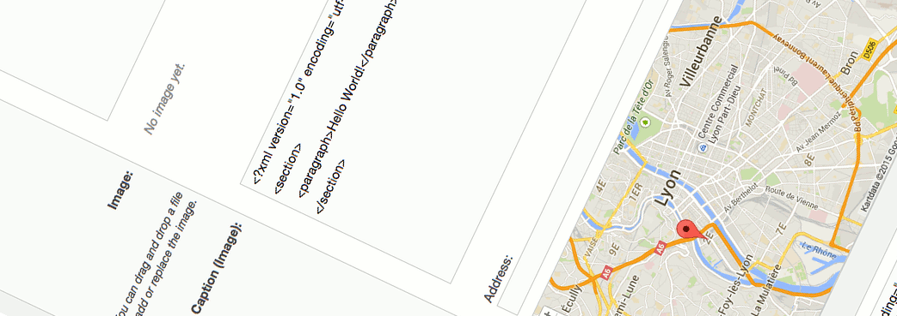

1.  [Developer](index.html)
2.  [Documentation](Documentation_31429504.html)
3.  [Releases](Releases_31429534.html)
4.  [Release Notes](Release-Notes_32867905.html)
5.  [eZ Platform Release notes](eZ-Platform-Release-notes_31429935.html)

**Developer : eZ Platform 15.01 Release notes**

Created by Dominika Kurek, last modified by David Christian Liedle on
Oct 31, 2016

**Introducing eZ Platform, “Alpha1”**

**4th March 2015**

+--------------------------------------------------------------------------+
| {.confluence-embedded-image} |
+--------------------------------------------------------------------------+
| Welcome to the first release of eZ Platform, 15.01 serves two purposes:  |
| As first alpha release of eZ Platform, and also as eZ Publish Community  |
| edition v2015.01 by installing optional legacy packages. Further         |
| information about eZ Platform (and eZ Studio), and what you can expect,  |
| can be found in recent blog post on                                      |
| ez.no &lt;http://ez.no/Blog/What-to-Expect-from-eZ-Studio-and-eZ-Platfor |
| m&gt;                                                                    |
| \_\_.                                                                    |
|                                                                          |
| **Quick links**                                                          |
|                                                                          |
| -                                                                        |
| Install &lt;https://github.com/ezsystems/ezplatform/blob/master/INSTALL  |
| .md&gt;\_\_ -                                                            |
| [Requirements](https://doc.ez.no/display/TMPA/Requirements+5.4)          |
| *(currently same as eZ Publish Platform 5.4)* - Upgrading: *As this is a |
| alpha release, there is no upgrade instructions yet, this will be        |
| available starting with the beta, currently                              |
| scheduled &lt;http://ez.no/Blog/What-Releases-to-Expect-from-eZ-in-2015  |
| &gt;\_\_ for May*                                                        |
|                                                                          |
| - Download: *Download* from                                              |
|                                                                          |
| :   \`share.ez.no/downloads                                              |
|     &lt;<http://share.ez.no/downloads/downloads/ez-pla>                  |
|                                                                          |
| tform-15.01-alpha&gt;\`\_\_                                              |
|                                                                          |
| :   or see *Install* for how to install via composer                     |
+--------------------------------------------------------------------------+

**Highlights**

**Legacy is “gone”**

This major milestone, and is what makes the first release of eZ Platform
possible. This is further covered in [Core Development blog
post](http://share.ez.no/blogs/core-development-team/farewell-ez-publish-legacy-welcome-ez-platform).
But in short: the related libraries, services and configuration have
been externalized to a new
package: [ezsystems/legacy-bridge](https://packagist.org/packages/ezsystems/legacy-bridge).
And since the eZ Platform is still in alpha, ezpublish-legacy and
legacy-bridge v2015.01 can still easily be installed.

**Ships with Platform UI Bundle v0.5**

Platform UI, [revealed last
july](http://share.ez.no/blogs/core-development-team/the-future-ez-publish-platform-backend-ui-is-here),
has received its first tag:
[v0.5](https://github.com/ezsystems/PlatformUIBundle/tree/v0.5.0). It
is pre-installed and pre-configured in this release, and it can be
accessed via `<example.com>/shell`.

See [blog post from
December](http://share.ez.no/blogs/core-development-team/platformui-december-2014-status)for
further information about the new User Interface.

**Prototype of native installer**

Since we can’t rely on legacy anymore, prototype of a native installer
has been added, as a console
script: `ezpublish/console ezplatform:install`. It is meant to be very
simple, fast, easy to automate, and easy to extend.

**Changelog**

*Changes* (Stories, Improvements and bug fixes) can be found in our
issue tracker:  [87
issues](https://jira.ez.no/secure/IssueNavigator.jspa?reset=true&jqlQuery=fixVersion%3D%222015.01%22+AND+project+%3D+EZP+AND+issuetype+in+%28Story%2C+Improvement%2C+Bug%29+order+by+issuetype+&src=confmacro)

**Known issues & upcoming features**

-   List of issues specifically affecting this release:  [42
    issues](https://jira.ez.no/secure/IssueNavigator.jspa?reset=true&jqlQuery=project+%3D+EZP+AND+issuetype+in+%28bug%29+AND+affectedVersion+%3D+2015.01+ORDER+BY+priority++&src=confmacro)
-   General “Known issues” in *Platform stack* compared to\* Legacy\*: 
    [8
    issues](https://jira.ez.no/secure/IssueNavigator.jspa?reset=true&jqlQuery=project+%3D+EZP+AND+affectedVersion+%3D%22Known+Issues+5.x+Stack%22+AND+resolution+%3D+Unresolved+ORDER+BY+priority+&src=confmacro)
-   Epics currently planned for first stable release:  [7
    issues](https://jira.ez.no/secure/IssueNavigator.jspa?reset=true&jqlQuery=project+%3D+EZP+AND+issuetype+%3D+Epic+AND+fixVersion%3DPollux+AND+resolution+%3D+Unresolved+ORDER+BY+priority+&src=confmacro)
-   Epics currently planned for first LTS release:  [0
    issue](https://jira.ez.no/secure/IssueNavigator.jspa?reset=true&jqlQuery=project+%3D+EZP+AND+issuetype+%3D+Epic+AND+fixVersion%3D%22Mauna+Kea%22+AND+resolution+%3D+Unresolved+ORDER+BY+priority++&src=confmacro)

 

**Attachments:**

{width="8px" height="8px"}
[Platform screenshoot alpha1.gif](attachments/31429941/31429937.gif)
(image/gif) {width="8px"
height="8px"} [iStock\_000032478246XLarge - banner
doc.jpg](attachments/31429941/31429938.jpg) (image/jpeg)
{width="8px" height="8px"}
[Ventoux-Square.jpg](attachments/31429941/31429939.jpg) (image/jpeg)
{width="8px" height="8px"}
[Getting-Started-with-eZ-Publish-Platform.jpg](attachments/31429941/31429940.jpg)
(image/jpeg)

Document generated by Confluence on Mar 24, 2017 17:20

[Atlassian](http://www.atlassian.com/)

