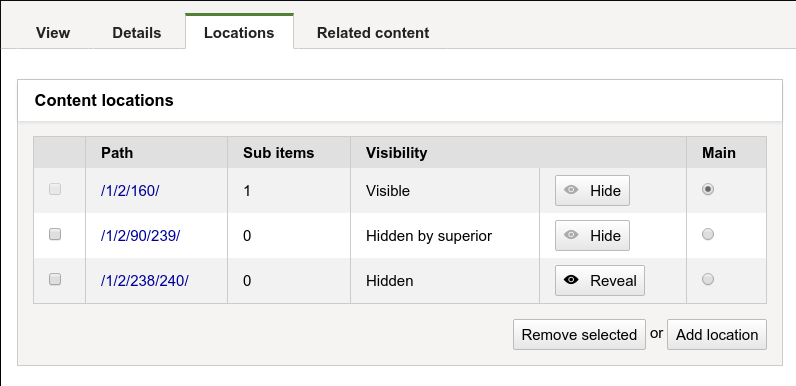
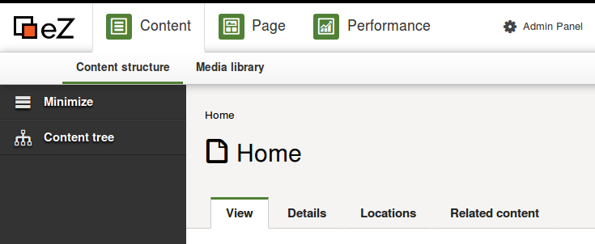
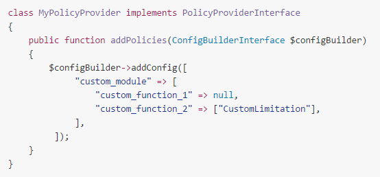

1.  [Developer](index.html)
2.  [Documentation](Documentation_31429504.html)
3.  [Releases](Releases_31429534.html)
4.  [Release Notes](Release-Notes_32867905.html)
5.  [eZ Platform Release notes](eZ-Platform-Release-notes_31429935.html)

**Developer : eZ Platform 15.09 Release notes**

Created by Dominika Kurek on Apr 18, 2016

**eZ Platform beta now available for testing**

**Quick links**

-   [Installation
    instructions](https://github.com/ezsystems/ezplatform/blob/release-2015.09.01/INSTALL.md)
-   [Requirements](https://doc.ez.no/display/TMPA/Requirements+5.4)
-   Download:
    See [share.ez.no/downloads](http://share.ez.no/downloads/downloads/ez-platform-15.09),
    or see *Install* for how to install via composer.

The fifth release of eZ Platform, 15.09, is the first in “beta”
stability. It builds upon the
[15.07](eZ-Platform-15.07-Release-notes_31429990.html) September alpha
release. It most notably provides many new UI features, both in this
download and continues to provide a few more additional UI features
during it’s beta period until end of month.

**Highlights**

Along with the [improvements and
fixes](#eZPlatform15.09Releasenotes-changelog) listed at the bottom, the
most notable changes are the sub-items list in PlatformUI, location &
relation tabs, and policies support in custom bundles.

**Platform UI sub-items list**

Sub-items will now be listed in PlatformUI. This is a minimum viable
feature. In further releases, this will be expanded to improve UX with
ability to change sub-items views and ability to easily add subitems.
For now the sub-items list view enables repository browsing via the
content view. 

Story: [EZP-24824](https://jira.ez.no/browse/EZP-24824)

**Platform UI languages improvements**

The list of content languages configured in the system is now correctly
passed on to the UI ([EZP-24865](https://jira.ez.no/browse/EZP-24865)),
avoiding errors on language selection. 

The language of the edited content can now be selected during editing
([EZP-23768](https://jira.ez.no/browse/EZP-23768))

**New PlatformUI content tabs**

Dedicated tabs have been added for relations
([EZP-24509](https://jira.ez.no/browse/EZP-24509)) and
locations ([EZP-24815](https://jira.ez.no/browse/EZP-24815)) of any
Content. Both will list a content’s relations and locations.

The location tab also allows to manage (add, remove, hide/unhide)
locations, as well as select a new main location (currently not
working).

{.confluence-embedded-image
width="450px"}

**Other UI improvements**

 

-   Content type groups can be managed
    ([EZP-24454](https://jira.ez.no/browse/EZP-24454))
-   Content types can be removed
    ([EZP-24453](https://jira.ez.no/browse/EZP-24453))
-   Users other than the admin can now login to Platform UI
    ([EZP-24753](https://jira.ez.no/browse/EZP-24753))
-   Limited user accounts management has been implemented
-   PJAX error messages are now correctly displayed
    ([EZP-24787](https://jira.ez.no/browse/EZP-24787))

 

{.confluence-embedded-image
width="450px"}

**Custom repository policies support**

Bundles can now declare custom modules, policies and limitations.

Links:
[documentation](https://github.com/ezsystems/ezpublish-kernel/blob/master/doc/specifications/security/permissions/policies_extensibility.md),
[EZP-24862](https://jira.ez.no/browse/EZP-24862).

{.confluence-embedded-image
width="450px"}

**Repository and Platform improvements**

-   Solr support for fullText location search
    ([EZP-24802](https://jira.ez.no/browse/EZP-24802))
-   ezcontentobject\_attribute stores always available flag to all
    fields
-   Float Fields now accepts integers
    ([EZP-24038](https://jira.ez.no/browse/EZP-24038))
-   An ancestor Search criterion has been added
    ([EZP-24804](https://jira.ez.no/browse/EZP-24804))
-   REST: users can be filtered by email and login
    ([EZP-24820](https://jira.ez.no/browse/EZP-24820))
-   Repository exceptions can be translated
    ([EZP-24793](https://jira.ez.no/browse/EZP-24793))
-   Bundles can now expose custom policies that can be checked via the
    repository ([EZP-24862](https://jira.ez.no/browse/EZP-24862))

 

**Changelog**

*Changes* (Stories, Improvements and bug fixes) can be found in our
issue tracker:  [67
issues](https://jira.ez.no/secure/IssueNavigator.jspa?reset=true&jqlQuery=fixVersion%3D%222015.07%22+AND+project+%3D+EZP+AND+issuetype+in+%28Story%2C+Improvement%2C+Bug%29+order+by+issuetype++++++++&src=confmacro)
 \*(some are still pending additional documentation changes)\*

**Known issues & upcoming features**

List of issues specifically affecting this release:  [35
issues](https://jira.ez.no/secure/IssueNavigator.jspa?reset=true&jqlQuery=project+%3D+EZP+AND+issuetype+in+%28bug%29+AND+affectedVersion+%3D+2015.05+ORDER+BY+priority++++++&src=confmacro)

General “Known issues” in *Platform stack* compared to\* Legacy\*:  [8
issues](https://jira.ez.no/secure/IssueNavigator.jspa?reset=true&jqlQuery=project+%3D+EZP+AND+affectedVersion+%3D%22Known+Issues+5.x+Stack%22+AND+resolution+%3D+Unresolved+ORDER+BY+priority+&src=confmacro)

Epics tentatively\* planned for first stable release:  [7
issues](https://jira.ez.no/secure/IssueNavigator.jspa?reset=true&jqlQuery=project+%3D+EZP+AND+issuetype+%3D+Epic+AND+fixVersion%3DPollux+AND+resolution+%3D+Unresolved+ORDER+BY+priority+&src=confmacro)

Epics tentatively\* planned for first LTS release:  [0
issue](https://jira.ez.no/secure/IssueNavigator.jspa?reset=true&jqlQuery=project+%3D+EZP+AND+issuetype+%3D+Epic+AND+fixVersion%3D%22Mauna+Kea%22+AND+resolution+%3D+Unresolved+ORDER+BY+priority++&src=confmacro)

*’\* Some of these features will not be in the stable releases, the once
we first and foremost will aim for having in the release are those
mentioned on
the [Roadmap](http://ez.no/Blog/What-to-Expect-from-eZ-Studio-and-eZ-Platform).*

 

**Attachments:**

{width="8px" height="8px"}
[platform-custom-policies.png](attachments/31430041/31430017.png)
(image/png) {width="8px"
height="8px"} [locations\_tab.png](attachments/31430041/31430018.png)
(image/png) {width="8px"
height="8px"}
[PlatformUI-navigation-bar.png](attachments/31430041/31430019.png)
(image/png) {width="8px"
height="8px"} [Please Help.jpg](attachments/31430041/31430020.jpg)
(image/jpeg) {width="8px"
height="8px"} [privacy cookie.PNG](attachments/31430041/31430021.png)
(image/png) {width="8px"
height="8px"} [move-copy-send to
trash.PNG](attachments/31430041/31430022.png) (image/png)
{width="8px" height="8px"}
[content\_download.PNG](attachments/31430041/31430023.png) (image/png)
{width="8px" height="8px"}
[variations purging.PNG](attachments/31430041/31430024.png) (image/png)
{width="8px" height="8px"}
[content type edition.PNG](attachments/31430041/31430025.png)
(image/png) {width="8px"
height="8px"}
[symfony\_black\_02.png](attachments/31430041/31430026.png) (image/png)
{width="8px" height="8px"}
[symfony\_black\_03.png](attachments/31430041/31430027.png) (image/png)
{width="8px" height="8px"}
[RichText editor.png](attachments/31430041/31430028.png) (image/png)
{width="8px" height="8px"}
[Ventoux-Square.jpg](attachments/31430041/31430029.jpg) (image/jpeg)
{width="8px" height="8px"}
[Getting-Started-with-eZ-Publish-Platform.jpg](attachments/31430041/31430030.jpg)
(image/jpeg) {width="8px"
height="8px"} [Platform screenshoot
alpha1.gif](attachments/31430041/31430031.gif) (image/gif)
{width="8px" height="8px"}
[Screen Shot 2015-05-12 at 19.16.38
.png](attachments/31430041/31430032.png) (image/png)
{width="8px" height="8px"}
[PrivacyCookieBundle.png](attachments/31430041/31430033.png) (image/png)
{width="8px" height="8px"}
[Screen Shot 2015-05-12 at 11.46.48
.png](attachments/31430041/31430034.png) (image/png)
{width="8px" height="8px"}
[iStock\_000032478246XLarge - banner
doc.jpg](attachments/31430041/31430035.jpg) (image/jpeg)
{width="8px" height="8px"}
[notifications.gif](attachments/31430041/31430036.gif) (image/gif)
{width="8px" height="8px"}
[Solr\_Logo\_on\_white.png](attachments/31430041/31430037.png)
(image/png) {width="8px"
height="8px"} [Platform 2015.07 - roles
UI.PNG](attachments/31430041/31430038.png) (image/png)
{width="8px" height="8px"}
[Platform 2015.07 - choose
translation.PNG](attachments/31430041/31430039.png) (image/png)
{width="8px" height="8px"} [eZ
Platform 2015.07 - add
translation.gif](attachments/31430041/31430040.gif) (image/gif)

Document generated by Confluence on Mar 24, 2017 17:20

[Atlassian](http://www.atlassian.com/)

