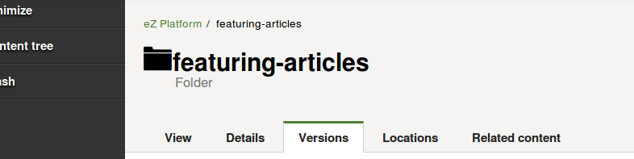

1.  [Developer](index.html)
2.  [Documentation](Documentation_31429504.html)
3.  [Releases](Releases_31429534.html)
4.  [Release Notes](Release-Notes_32867905.html)
5.  [eZ Platform Release notes](eZ-Platform-Release-notes_31429935.html)

**Developer : eZ Platform v1.5.0 Release notes**

Created by Sarah Haïm-Lubczanski, last modified on Sep 05, 2016

The 1.5.0 release of eZ Platform is available as of September 1st 2016.

For the release notes of the corresponding eZ Studio release, see [eZ
Enterprise v1.5.0 Release
notes](eZ-Enterprise-v1.5.0-Release-notes_32114946.html)

**Quick links**

-   [Installation
    instructions](https://doc.ez.no/display/DEVELOPER/Step+1%3A+Installation)
-   [Requirements](https://doc.ez.no/pages/viewpage.action?pageId=31429536)
-   [Download](http://share.ez.no/latest)

**Changes since 1.4.0**

For list of issues fixed in 1.5.0 see [our issue
tracker](https://jira.ez.no/issues/?filter=-1&jql=project%20%3D%20EZP%20AND%20resolution%20!%3D%20Unresolved%20AND%20fixVersion%20in%20(1.5.0)%20ORDER%20BY%20updatedDate%20ASC),
below is a list of notable bugs/features/enhancements done in this
release.

 

Backwards Compatibility Warning

We upgraded the versions for Flysystem and Stash. See below for more
details.

 

**In this topic:**

-   [Quick links](#eZPlatformv1.5.0Releasenotes-Quicklinks)
-   [Changes since
    1.4.0](#eZPlatformv1.5.0Releasenotes-Changessince1.4.0)
    -   [In this topic:](#eZPlatformv1.5.0Releasenotes-Inthistopic:)
-   [Version
    Management](#eZPlatformv1.5.0Releasenotes-VersionManagement)
-   [FullText search with Legacy (SQL)
    Engine](#eZPlatformv1.5.0Releasenotes-FullTextsearchwithLegacy(SQL)Engine)
-   [Preparations for Symfony 3
    support](#eZPlatformv1.5.0Releasenotes-PreparationsforSymfony3support)
-   [Other notable
    improvements](#eZPlatformv1.5.0Releasenotes-Othernotableimprovements)
-   [Full list of
    changes](#eZPlatformv1.5.0Releasenotes-Fulllistofchanges)

[Updating](#eZPlatformv1.5.0Releasenotes-Updating)

-   [New eZ packages in this
    release](#eZPlatformv1.5.0Releasenotes-NeweZpackagesinthisrelease)

**Version Management**

In this version, you have a new tab “Versions” under which you will be
able to manage Versions and Drafts.

{.confluence-embedded-image
height="150px"}

See the video screencast for a demonstration of this feature.

-   [EZP-25463](https://jira.ez.no/browse/EZP-25463): Ability to remove
    drafts
-   [EZP-25462](https://jira.ez.no/browse/EZP-25462): Ability to remove
    archived versions
-   [EZP-26089](https://jira.ez.no/browse/EZP-26089): Ability to edit a
    draft
-   [EZP-25465](https://jira.ez.no/browse/EZP-25465): Implement a Draft
    conflict screen

 

**FullText search with Legacy (SQL) Engine**

As part of [EZP-25088](https://jira.ez.no/browse/EZP-25088) FullText
indexing is now also working when not using Solr. This will never be as
advanced as with Solr, but it provides basic search without setting up
Solr.

**Preparations for Symfony 3 support**

This release has received lots of fixes to remove deprecation warnings
when running on Symfony 2.8 to the point where we now have automated
testing using Symfony 3.x. These changes will simplify the move to
Symfony 3.x later, also for your own custom code as you can now enable
full error reporting.

**Other notable improvements**

-   **Languages:**
    -   [EZP-25323](https://jira.ez.no/browse/EZP-25323): Display
        Content Type name and Field definition name in the best language
        according to editor’s browser setting.
-   **REST:**
    -   [EZP-24853](https://jira.ez.no/browse/EZP-24853): REST output
        when failing to save/create a draft has been improved.
    -   [EZP-26110](https://jira.ez.no/browse/EZP-26110): Added priority
        support to OutputVisitor, so that custom ones can be given a
        higher priority.
    -   [EZP-26080](https://jira.ez.no/browse/EZP-26080): REST routes
        can be registered with a prefix other than “ezp”.
-   **Browser support:**
    -   [EZP-25725](https://jira.ez.no/browse/EZP-25725): Upgraded
        AlloyEditor to v1.2.3 and CK Editor to v4.5.9
-   **Platform support:**
    -   [EZP-25676](https://jira.ez.no/browse/EZP-25676): Upgraded
        Flysystem to v1.x
        -   *And took advantage of that to
            implement* [EZP-25965](https://jira.ez.no/browse/EZP-25965): Configurable
            IO filesystem permissions.
    -   [EZP-26161](https://jira.ez.no/browse/EZP-26161): Upgraded Stash
        Bundle to v0.6 with better Redis support *(cluster setup
        with PHP7)*
    -   [EZP-25942](https://jira.ez.no/browse/EZP-25942): Improved
        Windows support with continuous testing on
        Windows *(using AppVeyor)*
-   **Solr:**
    -   [EZP-26123](https://jira.ez.no/browse/EZP-26123): Extract facets
        of all Types
-   **Performance:**
    -   [EZP-26071](https://jira.ez.no/browse/EZP-26071): Download asset
        binary only if we need to create a variation\* \*
        -   *Contribution by Inviqa to improve performance when running
            eZ Platform on S3*
-   **Developer Experience:**
    -   Docker: Added Redis support and some more inline documentation
        (see \\ doc/[ folder](https://github.com/ezsystems/ezplatform/blob/ff191377fc68c53478c68da892f9eb79dce6347e/doc/docker-compose/redis.yml))

**Full list of changes**

For full list of changes see issue list in JIRA:  [44
issues](https://jira.ez.no/secure/IssueNavigator.jspa?reset=true&jqlQuery=project%3DEZP+and+fixVersion%3D1.5.0+&src=confmacro)

**Updating**

To update to this version, follow the [Updating eZ
Platform](Updating-eZ-Platform_31431770.html) guide and use `v1.5.0`
as `<version>`.

**New eZ packages in this release**

  Package Name                         1.5.0 version
  ------------------------------------ ------------------------------------
  ezplatform-solr-search-engine        1.1.0
  ezpublish-kernel                     6.5.0
  platform-ui-assets-bundle            3.0.0
  repository-forms                     1.4.0
  platform-ui-bundle                   1.5.0

 

**Attachments:**

{width="8px" height="8px"} [Draft
demo.webm](attachments/32114891/32115229.webm) (video/webm)
{width="8px" height="8px"}
[featuring-articles\_eZ\_Platform\_-\_eZ\_Platform\_UI\_-\_2016-08-31\_17.44.15.png](attachments/32114891/32115355.png)
(image/png)

Document generated by Confluence on Mar 24, 2017 17:20

[Atlassian](http://www.atlassian.com/)

