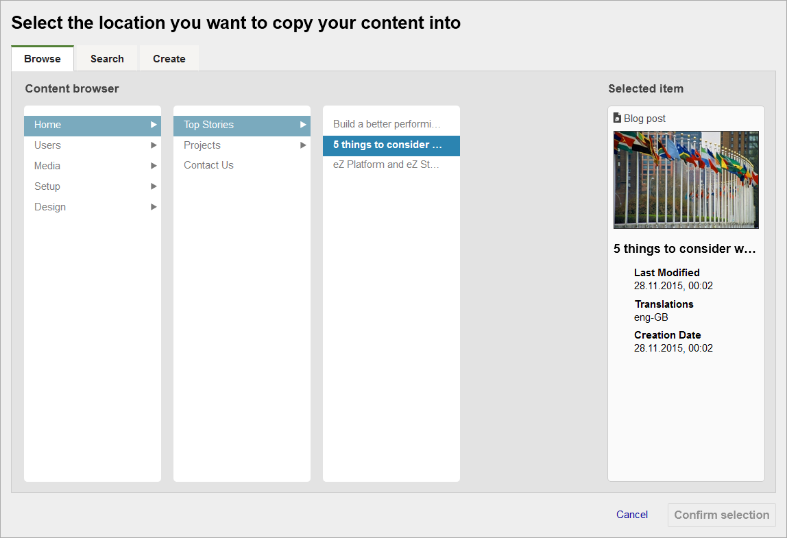
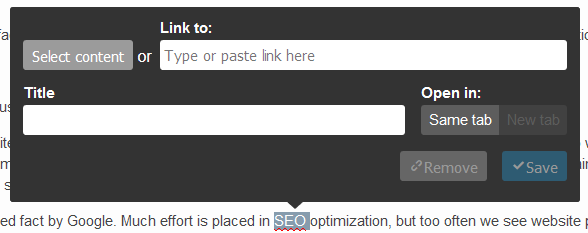
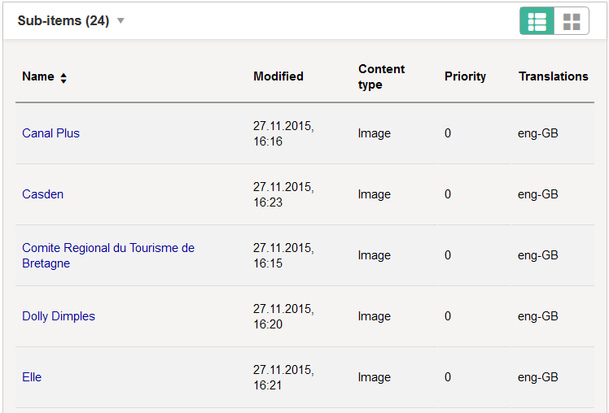
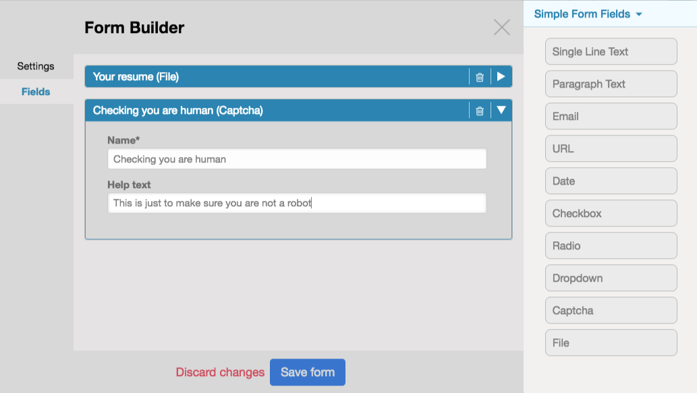
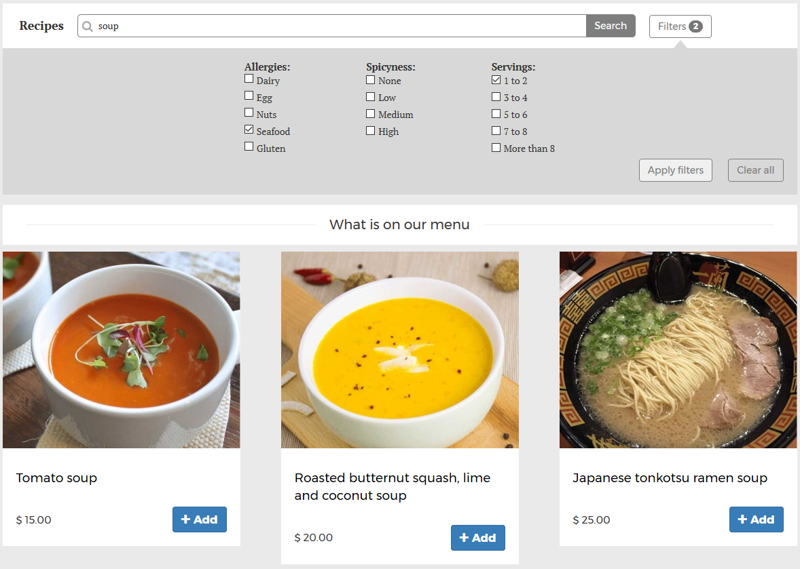

1.  [Developer](index.html)
2.  [Documentation](Documentation_31429504.html)
3.  [Releases](Releases_31429534.html)
4.  [Release Notes](Release-Notes_32867905.html)

**Developer : eZ Platform v1.8.0**

Created by David Christian Liedle, last modified by Dominika Kurek on
Feb 20, 2017

**The FAST TRACK v1.8.0 release of eZ Platform and eZ Platform
Enterprise Edition is available as of February 16, 2016.**

If you are looking for the Long Term Support (LTS) release,
see[ https://ezplatform.com/Blog/Long-Term-Support-is-Here](https://ezplatform.com/Blog/Long-Term-Support-is-Here)

 

-   [Notable Changes Since v1.7.0
    LTS](#eZPlatformv1.8.0-NotableChangesSincev1.7.0LTS)
    -   [eZ Platform](#eZPlatformv1.8.0-eZPlatform)
    -   [eZ Platform Enterprise
        Edition](#eZPlatformv1.8.0-eZPlatformEnterpriseEdition)
    -   [Updated eZ Platform/EE Demo
        Distributions](#eZPlatformv1.8.0-UpdatedeZPlatform/EEDemoDistributions)
-   [Full list of new features, improvements and bug fixes since v1.7.0
    LTS:](#eZPlatformv1.8.0-Fulllistofnewfeatures,improvementsandbugfixessincev1.7.0LTS:)

**Notable Changes Since v1.7.0 LTS**

**eZ Platform**

**User Interface**

-   In Universal Discovery Widget (UDW) the browse view now uses a
    completely new browser widget, which replaces Treeview. This solves
    limitations on how many items you can browse for, and provides a
    more intuitive user experience.

{.confluence-embedded-image
.image-center width="600px"}

-   Improvements in the Online Editor:
    -   You now have the ability to rearrange elements in the editor by
        moving them up and down.
    -   You can now add links to internal content items in the Online
        Editor, decide in which tab the link should open, and set link
        title:{.confluence-embedded-image
        .image-center}
-   Improvements to the Sub-Items view of a Content Item: You can now
    sort content items by clicking column headings

{.confluence-embedded-image
.image-center width="400px"}

-   The main titles of the ContentTypeView now expand and retract with
    an accordion function
-   Updated and added icons for the Admin Interface
-   The whole interface of PlatformUI is now translatable using Crowdin,
    including in-context translation where you can navigate the
    interface while translating. A glossary has been established to aid
    in unified usage of terminology throughout. [Contributions
    welcome](https://crowdin.com/project/ezplatform)!

**Under the Hood**

-   New opt-in approach to HttpCache to improve usability as well as
    performance by means of:
    -   Cache multi-tagging: allowing you to tag pages with a path,
        location, type, parent, etc. so the repository can clear cache
        in a more targeted, accurate, and flexible way, getting rid of
        any “clear all” situations on complex operations.
    -   For Varnish this uses
        [xkey](https://github.com/varnish/varnish-modules/blob/master/docs/vmod_xkey.rst) instead
        of BAN, enabling greater performance by allowing you to control
        grace time.
    -   This also places HttpCache in a separate repo, allowing it to
        grow independently:
        see <https://github.com/ezsystems/ezplatform-http-cache>
-   New `content/publish` policy to be able to
    configure `content/edit` rights independently from publish rights
-   Community-provided translations of the user interface may be
    imported individually to conserve resources
-   Replaced deprecated templating helper assets with assets packages
    service
-   Localization of handlebar templates
-   Also part of v1.7.1 from the end of January:
    -   Solr: Solving last issues in UI hindering relative ranking of
        search results from working properly
    -   API: Respect `defaultAlwaysAvailable` setting
        on `newContentCreateStruct` solving issues with for instance
        Kaliop Migrations bundle use
    -   Landing pages: Better support for wider range of multi-site
        setups
    -   Online Editor: Ability to change a paragraph to header and back

> \*For the complete list of fixes and improvements, see the GitHub

release
notes: <https://github.com/ezsystems/ezplatform/releases/tag/v1.8.0*>

**eZ Platform Enterprise Edition**

**Studio**

-   New fields are available for the Form Builder:
    -   URL
    -   Date
    -   Checkbox
    -   Radio
    -   Dropdown
    -   Captcha
    -   File Upload

 

{.confluence-embedded-image
.image-center height="400px"}

**Under the Hood**

-   StudioUI is now fully ready for Internationalization

**Updated eZ Platform/EE Demo Distributions**

-   You can now search and filter products in the Product Page of the EE
    Demo distribution:

{.confluence-embedded-image
.image-center width="400px"}

**Full list of new features, improvements and bug fixes since v1.7.0
LTS:**

  -------------------------------------------------------------------------
  .. rubric:: eZ Platform :name:       .. rubric:: eZ Enterprise :name:
  eZPlatformv1.8.0-eZPlatfor m.1       eZPlatformv1.8.0-eZEnterpr ise
  ------------------------------------ ------------------------------------
  List of changes for final of eZ      List of changes for final for eZ
  Platform v1.8.0 on                   Platform Enterprise Edition v1.8.0
  GitHub &lt;https://github.com/ezsyst on
  ems                                  GitHub &lt;https://github.com/ezsyst
  /ezplatform/releases/tag/v1.8.0&gt;\ ems
  _\_                                  /ezstudio/releases/tag/v1.8.0&gt;\_\
                                       _
                                        

  List of changes for rc1 of eZ        List of changes for rc1 of eZ
  Platform v1.8.0 on                   Platform Enterprise Edition v1.8.0
  GitHub &lt;https://github.com/ezsyst on
  ems                                  GitHub &lt;https://github.com/ezsyst
  /ezplatform/releases/tag/v1.8.0-rc1& ems
  gt;                                  /ezstudio/releases/tag/v1.8.0-rc1&gt
  \_\_                                 ;\_
                                       \_

  List of changes for beta1 of eZ      List of changes for beta2 of eZ
  Platform v1.8.0 on                   Platform Enterprise Edition v1.8.0
  Github &lt;https://github.com/ezsyst on
  ems                                  Github &lt;https://github.com/ezsyst
  /ezplatform/releases/tag/v1.8.0-beta ems
  1&gt;\_\_                            /ezstudio/releases/tag/v1.8.0-beta2&
                                       gt;
                                       \_\_
  -------------------------------------------------------------------------

**Installation**

[Installation
Guide](https://doc.ez.no/display/DEVELOPER/Step+1%3A+Installation)

> [Technical Requirements](31429536.html)

**Download**

**eZ Platform**

-   Download at [eZPlatform.com](http://ezplatform.com/#download)

 

 

**eZ Platform Enterprise Edition**

-   [Customers: eZ Enterprise subscription
    (BUL License)](https://support.ez.no/Downloads) \* \*
-   [Partners: Test & Trial software access
    (TTL License)](https://support.ez.no/Downloads)

If you would like to request an Enterprise Demo instance:
<http://ez.no/Forms/Discover-eZ-Studio>

 

**Updating**

**eZ Platform**: To update to this version, follow the [Updating eZ
Platform](https://doc.ez.no/display/DEVELOPER/Updating+eZ+Platform)
guide and use v1.8.0 as `<version>`.

 

**Attachments:**

{width="8px" height="8px"}
[Screen Shot 2016-12-14 at 4.12.40
PM.png](attachments/33555269/33555261.png) (image/png)
{width="8px" height="8px"}
[Screen Shot 2016-12-14 at 4.05.42
PM.png](attachments/33555269/33555262.png) (image/png)
{width="8px" height="8px"}
[Screen Shot 2016-12-14 at 3.59.41
PM.png](attachments/33555269/33555263.png) (image/png)
{width="8px" height="8px"}
[Screen Shot 2016-12-14 at 3.56.51
PM.png](attachments/33555269/33555264.png) (image/png)
{width="8px" height="8px"}
[Screen Shot 2016-12-14 at 3.51.42
PM.png](attachments/33555269/33555265.png) (image/png)
{width="8px" height="8px"}
[Screen Shot 2016-12-14 at 3.46.21
PM.png](attachments/33555269/33555266.png) (image/png)
{width="8px" height="8px"}
[form-builder-1.png](attachments/33555269/33555267.png) (image/png)
{width="8px" height="8px"}
[future\_publication\_window.png](attachments/33555269/33555268.png)
(image/png) {width="8px"
height="8px"} [new\_form\_fields.png](attachments/33555269/33555482.png)
(image/png) {width="8px"
height="8px"} [udw.png](attachments/33555269/33555699.png) (image/png)
{width="8px" height="8px"}
[link-options-oe.png](attachments/33555269/33555700.png) (image/png)
{width="8px" height="8px"}
[subitem-sorting.png](attachments/33555269/33555701.png) (image/png)
{width="8px" height="8px"}
[demo-product-filters.png](attachments/33555269/33555702.png)
(image/png) {width="8px"
height="8px"} [Screen Shot 2017-02-16 at 2.10.00
PM.png](attachments/33555269/33555813.png) (image/png)

Document generated by Confluence on Mar 24, 2017 17:20

[Atlassian](http://www.atlassian.com/)

