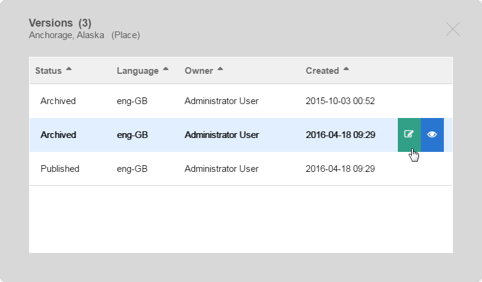

1.  [Developer](index.html)
2.  [Documentation](Documentation_31429504.html)
3.  [Releases](Releases_31429534.html)
4.  [Release Notes](Release-Notes_32867905.html)
5.  [eZ Enterprise Release
    notes](eZ-Enterprise-Release-notes_31430108.html)

**Developer : eZ Studio 2016.04 Release notes**

Created by Dominika Kurek, last modified on Jan 30, 2017

-   [Quick links](#eZStudio2016.04Releasenotes-Quicklinks)
-   [Changes since
    16.02](#eZStudio2016.04Releasenotes-Changessince16.02)
    -   [Summary of
        changes](#eZStudio2016.04Releasenotes-Summaryofchanges)
    -   [Full list of
        improvements](#eZStudio2016.04Releasenotes-Fulllistofimprovements)
    -   [Full list of
        bugfixes](#eZStudio2016.04Releasenotes-Fulllistofbugfixes)
-   [Updating](#eZStudio2016.04Releasenotes-Updating)

 

The 16.04 release of eZ Studio is available as of 28 April 2016.

The semantic version of this release is v1.3.0.

For the release notes of the corresponding *(and included)* eZ Platform
release, see [eZ Platform 2016.04 Release
notes](eZ-Platform-2016.04-Release-notes_31431643.html)

 

**Quick links**

-   [Installation
    instructions](https://doc.ez.no/display/TECHDOC/Installation)
-   [Requirements](https://doc.ez.no/display/TECHDOC/Requirements)
-   Download:
    -   As Customer with eZ Enterprise
        subscription: <https://support.ez.no/Downloads> *(
        [BUL](http://ez.no/About-our-Software/Licenses-and-agreements/eZ-Business-Use-License-Agreement-eZ-BUL-Version-2.1?return=/About-our-Software/Licenses-and-agreements/eZ-Business-Use-License-Agreement-eZ-BUL-Version-2.1?processed=1457699707&return=%2FAbout-our-Software%2FLicenses-and-agreements%2FeZ-Business-Use-License-Agreement-eZ-BUL-Version-2.1?return=%2FAbout-our-Software%2FLicenses-and-agreements%2FeZ-Business-Use-License-Agreement-eZ-BUL-Version-2.1)*
        -   License)\*
    -   As Partner with Test & Trial software
        access: <https://support.ez.no/Downloads> \*  *(
        [TTL](http://ez.no/About-our-Software/Licenses-and-agreements/eZ-Trial-and-Test-License-Agreement-eZ-TTL-v2.0)*
        \* License)\* \*
    -   If none of the above, request a demo
        instance: <http://ez.no/Forms/HTML-forms/Discover-eZ-Studio>

 

**Changes since 16.02**

**Summary of changes**

-   Included a mechanism for migrating legacy Flow content to eZ Studio
    Landing Pages. See [Migrating legacy Page field (ezflow) to Landing
    Page (Enterprise)](31431405.html).
-   You can now preview and edit previous versions of content in
    Page mode.

In Page mode a new Versions button in available in the Studio toolbar.
Click it to view a list of all versions of the current Content item.

{.confluence-embedded-image}

When you point to a Content item in the list, two icons appear. You can
choose to view a selected version, or to edit in:

{.confluence-embedded-image
height="250px"}

-   Visual change to studio toolbar: addition of a Version button and an
    Options menu

The Options menu allows you to copy the URL of the current Content item,
and to send the item to Trash:

{.confluence-embedded-image
.confluence-thumbnail height="150px"}

-   You can now send content to Trash directly from Page mode.

Use the new Options menu to send a Content item to trash. You then need
to go to Content mode to view and manage items in Trash.

-   When installing, you can now choose Studio with demo content, or a
    clean installation.

The main meta repository has been split in two: **ezstudio** with clean
installer and **ezstudio-demo** with demo content. See the [Updating eZ
Platform](Updating-eZ-Platform_31431770.html) guide to learn how to
select the repository to update to.

 

**Full list of improvements**

  -------------------- --------------------------------------------- -----
  Key                  Summary                                       T

  [EZEE-679](https://j [Xsd Validation for XML                       [ =confmacro)                                   ment]
                                                                     (http
                                                                     s://j
                                                                     ira.e
                                                                     z.no/
                                                                     image
                                                                     s/ico
                                                                     ns/is
                                                                     suety
                                                                     pes/i
                                                                     mprov
                                                                     ement
                                                                     .png)
                                                                     {.ico
                                                                     n}](h
                                                                     ttps:
                                                                     //jir
                                                                     a.ez.
                                                                     no/br
                                                                     owse/
                                                                     DEMO-
                                                                     16?sr
                                                                     c=con
                                                                     fmacr
                                                                     o)

  [EZEE-668](https://j [Studio static layout shouldn’t have          [ template](https://jira.ez.no/browse/EZEE-668? ttps:
                       src=confmacro)                                //jir
                                                                     a.ez.
                                                                     no/im
                                                                     ages/
                                                                     icons
                                                                     /issu
                                                                     etype
                                                                     s/tas
                                                                     k.png
                                                                     ){.ic
                                                                     on}](
                                                                     https
                                                                     ://ji
                                                                     ra.ez
                                                                     .no/b
                                                                     rowse
                                                                     /EZEE
                                                                     -408?
                                                                     src=c
                                                                     onfma
                                                                     cro)

  [EZEE-614](https://j [<noreply@ez.no> is default for               [ -614?src=confmacro)                           ttps:
                                                                     //jir
                                                                     a.ez.
                                                                     no/im
                                                                     ages/
                                                                     icons
                                                                     /issu
                                                                     etype
                                                                     s/tas
                                                                     k.png
                                                                     ){.ic
                                                                     on}](
                                                                     https
                                                                     ://ji
                                                                     ra.ez
                                                                     .no/b
                                                                     rowse
                                                                     /EZEE
                                                                     -408?
                                                                     src=c
                                                                     onfma
                                                                     cro)

  [EZEE-612](https://j [As an administrator I want to have access to [ Studio](https://jira.ez.no/browse/EZEE-612?sr https
                       c=confmacro)                                  ://ji
                                                                     ra.ez
                                                                     .no/i
                                                                     mages
                                                                     /icon
                                                                     s/iss
                                                                     uetyp
                                                                     es/st
                                                                     ory.p
                                                                     ng){.
                                                                     icon}
                                                                     ](htt
                                                                     ps://
                                                                     jira.
                                                                     ez.no
                                                                     /brow
                                                                     se/EZ
                                                                     EE-20
                                                                     7?src
                                                                     =conf
                                                                     macro
                                                                     )

  [EZEE-611](https://j [Landing Page field type should have default  [ blocks](https://jira.ez.no/browse/EZEE-611?sr ttps:
                       c=confmacro)                                  //jir
                                                                     a.ez.
                                                                     no/im
                                                                     ages/
                                                                     icons
                                                                     /issu
                                                                     etype
                                                                     s/tas
                                                                     k.png
                                                                     ){.ic
                                                                     on}](
                                                                     https
                                                                     ://ji
                                                                     ra.ez
                                                                     .no/b
                                                                     rowse
                                                                     /EZEE
                                                                     -408?
                                                                     src=c
                                                                     onfma
                                                                     cro)

  [EZEE-610](https://j [As a user I want to have an administrator    [ install](https://jira.ez.no/browse/EZEE-610?s https
                       rc=confmacro)                                 ://ji
                                                                     ra.ez
                                                                     .no/i
                                                                     mages
                                                                     /icon
                                                                     s/iss
                                                                     uetyp
                                                                     es/st
                                                                     ory.p
                                                                     ng){.
                                                                     icon}
                                                                     ](htt
                                                                     ps://
                                                                     jira.
                                                                     ez.no
                                                                     /brow
                                                                     se/EZ
                                                                     EE-20
                                                                     7?src
                                                                     =conf
                                                                     macro
                                                                     )

  [EZEE-609](https://j [As a user I want to have basic content types [ install](https://jira.ez.no/browse/EZEE-609?s https
                       rc=confmacro)                                 ://ji
                                                                     ra.ez
                                                                     .no/i
                                                                     mages
                                                                     /icon
                                                                     s/iss
                                                                     uetyp
                                                                     es/st
                                                                     ory.p
                                                                     ng){.
                                                                     icon}
                                                                     ](htt
                                                                     ps://
                                                                     jira.
                                                                     ez.no
                                                                     /brow
                                                                     se/EZ
                                                                     EE-20
                                                                     7?src
                                                                     =conf
                                                                     macro
                                                                     )

  [EZEE-587](https://j [Timeline / Airtime after automating          [ rc=confmacro)                                 ment]
                                                                     (http
                                                                     s://j
                                                                     ira.e
                                                                     z.no/
                                                                     image
                                                                     s/ico
                                                                     ns/is
                                                                     suety
                                                                     pes/i
                                                                     mprov
                                                                     ement
                                                                     .png)
                                                                     {.ico
                                                                     n}](h
                                                                     ttps:
                                                                     //jir
                                                                     a.ez.
                                                                     no/br
                                                                     owse/
                                                                     DEMO-
                                                                     16?sr
                                                                     c=con
                                                                     fmacr
                                                                     o)

  [EZEE-581](https://j [As a user, I want to create a new draft of a [ drafts](https://jira.ez.no/browse/EZEE-581?sr https
                       c=confmacro)                                  ://ji
                                                                     ra.ez
                                                                     .no/i
                                                                     mages
                                                                     /icon
                                                                     s/iss
                                                                     uetyp
                                                                     es/st
                                                                     ory.p
                                                                     ng){.
                                                                     icon}
                                                                     ](htt
                                                                     ps://
                                                                     jira.
                                                                     ez.no
                                                                     /brow
                                                                     se/EZ
                                                                     EE-20
                                                                     7?src
                                                                     =conf
                                                                     macro
                                                                     )

  [EZEE-580](https://j [As a user, I want to edit a landing page     [ drafts](https://jira.ez.no/browse/EZEE-580?sr https
                       c=confmacro)                                  ://ji
                                                                     ra.ez
                                                                     .no/i
                                                                     mages
                                                                     /icon
                                                                     s/iss
                                                                     uetyp
                                                                     es/st
                                                                     ory.p
                                                                     ng){.
                                                                     icon}
                                                                     ](htt
                                                                     ps://
                                                                     jira.
                                                                     ez.no
                                                                     /brow
                                                                     se/EZ
                                                                     EE-20
                                                                     7?src
                                                                     =conf
                                                                     macro
                                                                     )

  [EZEE-579](https://j [As a user, I want to edit a landing page     [ drafts](https://jira.ez.no/browse/EZEE-579?sr https
                       c=confmacro)                                  ://ji
                                                                     ra.ez
                                                                     .no/i
                                                                     mages
                                                                     /icon
                                                                     s/iss
                                                                     uetyp
                                                                     es/st
                                                                     ory.p
                                                                     ng){.
                                                                     icon}
                                                                     ](htt
                                                                     ps://
                                                                     jira.
                                                                     ez.no
                                                                     /brow
                                                                     se/EZ
                                                                     EE-20
                                                                     7?src
                                                                     =conf
                                                                     macro
                                                                     )

  [EZEE-578](https://j [As a user, I want to create and publish a    [ version](https://jira.ez.no/browse/EZEE-578?s https
                       rc=confmacro)                                 ://ji
                                                                     ra.ez
                                                                     .no/i
                                                                     mages
                                                                     /icon
                                                                     s/iss
                                                                     uetyp
                                                                     es/st
                                                                     ory.p
                                                                     ng){.
                                                                     icon}
                                                                     ](htt
                                                                     ps://
                                                                     jira.
                                                                     ez.no
                                                                     /brow
                                                                     se/EZ
                                                                     EE-20
                                                                     7?src
                                                                     =conf
                                                                     macro
                                                                     )

  [EZEE-577](https://j [As a user, I want to view other versions of  [ content](https://jira.ez.no/browse/EZEE-577?s https
                       rc=confmacro)                                 ://ji
                                                                     ra.ez
                                                                     .no/i
                                                                     mages
                                                                     /icon
                                                                     s/iss
                                                                     uetyp
                                                                     es/st
                                                                     ory.p
                                                                     ng){.
                                                                     icon}
                                                                     ](htt
                                                                     ps://
                                                                     jira.
                                                                     ez.no
                                                                     /brow
                                                                     se/EZ
                                                                     EE-20
                                                                     7?src
                                                                     =conf
                                                                     macro
                                                                     )

  [EZEE-469](https://j [As a user, I want to send my content to the  [ =confmacro)                                   https
                                                                     ://ji
                                                                     ra.ez
                                                                     .no/i
                                                                     mages
                                                                     /icon
                                                                     s/iss
                                                                     uetyp
                                                                     es/st
                                                                     ory.p
                                                                     ng){.
                                                                     icon}
                                                                     ](htt
                                                                     ps://
                                                                     jira.
                                                                     ez.no
                                                                     /brow
                                                                     se/EZ
                                                                     EE-20
                                                                     7?src
                                                                     =conf
                                                                     macro
                                                                     )

  [EZEE-443](https://j [As a User, I want the nav-bar to collapse in [                                    (http
                                                                     s://j
                                                                     ira.e
                                                                     z.no/
                                                                     image
                                                                     s/ico
                                                                     ns/is
                                                                     suety
                                                                     pes/i
                                                                     mprov
                                                                     ement
                                                                     .png)
                                                                     {.ico
                                                                     n}](h
                                                                     ttps:
                                                                     //jir
                                                                     a.ez.
                                                                     no/br
                                                                     owse/
                                                                     DEMO-
                                                                     16?sr
                                                                     c=con
                                                                     fmacr
                                                                     o)

  [EZEE-408](https://j [Increase default upload max image            [ confmacro)                                    ttps:
                                                                     //jir
                                                                     a.ez.
                                                                     no/im
                                                                     ages/
                                                                     icons
                                                                     /issu
                                                                     etype
                                                                     s/tas
                                                                     k.png
                                                                     ){.ic
                                                                     on}](
                                                                     https
                                                                     ://ji
                                                                     ra.ez
                                                                     .no/b
                                                                     rowse
                                                                     /EZEE
                                                                     -408?
                                                                     src=c
                                                                     onfma
                                                                     cro)

  [EZEE-207](https://j [As a user I want to save a draft of my new   [ draft](https://jira.ez.no/browse/EZEE-207?src https
                       =confmacro)                                   ://ji
                                                                     ra.ez
                                                                     .no/i
                                                                     mages
                                                                     /icon
                                                                     s/iss
                                                                     uetyp
                                                                     es/st
                                                                     ory.p
                                                                     ng){.
                                                                     icon}
                                                                     ](htt
                                                                     ps://
                                                                     jira.
                                                                     ez.no
                                                                     /brow
                                                                     se/EZ
                                                                     EE-20
                                                                     7?src
                                                                     =conf
                                                                     macro
                                                                     )

  [DEMO-16](https://ji [As an editor, I want to have 3 siteaccesses  [                                     (http
                                                                     s://j
                                                                     ira.e
                                                                     z.no/
                                                                     image
                                                                     s/ico
                                                                     ns/is
                                                                     suety
                                                                     pes/i
                                                                     mprov
                                                                     ement
                                                                     .png)
                                                                     {.ico
                                                                     n}](h
                                                                     ttps:
                                                                     //jir
                                                                     a.ez.
                                                                     no/br
                                                                     owse/
                                                                     DEMO-
                                                                     16?sr
                                                                     c=con
                                                                     fmacr
                                                                     o)
  -------------------- --------------------------------------------- -----

> \`18

issues
&lt;<https://jira.ez.no/secure/IssueNavigator.jspa?reset=true&jqlQuery=key+%3D+EZS-679+OR+key+%3D+EZS-207+OR+key+%3D+EZS-443+OR+key+%3D+EZS-558+OR+key+%3D+EZS-408+OR+key+%3D+EZS-580+OR+key+%3D+EZS-581+OR+key+%3D+EZS-579+OR+key+%3D+EZS-578+OR+key+%3D+EZS-577+OR+key+%3D+EZS-668+OR+key+%3D+EZS-469+OR+key+%3D+EZS-612+OR+key+%3D+EZS-611+OR+key+%3D+EZS-610+OR+key+%3D+EZS-609+OR+key+%3D+EZS-614+OR+key+%3D+EZS-587+&src=confmacro>&gt;\_\_

.. raw:: html

   &lt;/div&gt;

.. raw:: html

   &lt;/div&gt;

.. raw:: html

   &lt;/div&gt;

.. raw:: html

   &lt;div class="columnMacro"
   style="width:40%;min-width:40%;max-width:40%;"&gt;

 

.. raw:: html

   &lt;/div&gt;

.. raw:: html

   &lt;/div&gt;

.. raw:: html

   &lt;/div&gt;

.. raw:: html

   &lt;/div&gt;

 

.. rubric:: Full list of bugfixes
   :name: eZStudio2016.04Releasenotes-Fulllistofbugfixes

.. raw:: html

   &lt;div class="sectionColumnWrapper"&gt;

.. raw:: html

   &lt;div class="sectionMacro"&gt;

.. raw:: html

   &lt;div class="sectionMacroRow"&gt;

.. raw:: html

   &lt;div class="columnMacro"
   style="width:60 %;min-width:60 %;max-width:60 %;"&gt;

 

.. raw:: html

   &lt;div id="refresh-module-1848925653"&gt;

.. raw:: html

   &lt;div id="jira-issues-1848925653"
   style="width: 100%;  overflow: auto;"&gt;

+-------------------------------------------------------------------+-------------------------------------------------------------------------------------------------------------------------------------------------------+---------+
| Key                                                               | Summary                                                                                                                                               | T       |
+-------------------------------------------------------------------+-------------------------------------------------------------------------------------------------------------------------------------------------------+---------+
| EZEE-749
&lt;<https://jira.ez.no/browse/EZEE-749?src=confmacro>&gt;\_\_   | Versions
pop-up form vertical scrollbar cannot be dragged by mouse
&lt;<https://jira.ez.no/browse/EZEE-749?src=confmacro>&gt;\_\_                             | |Bug|   |
+-------------------------------------------------------------------+-------------------------------------------------------------------------------------------------------------------------------------------------------+---------+
| EZEE-743
&lt;<https://jira.ez.no/browse/EZEE-743?src=confmacro>&gt;\_\_   | Incorrect
block drop animation
&lt;<https://jira.ez.no/browse/EZEE-743?src=confmacro>&gt;\_\_                                                                 | |Bug|   |
+-------------------------------------------------------------------+-------------------------------------------------------------------------------------------------------------------------------------------------------+---------+
| EZEE-740
&lt;<https://jira.ez.no/browse/EZEE-740?src=confmacro>&gt;\_\_   | eZ
Studio language switcher not working
&lt;<https://jira.ez.no/browse/EZEE-740?src=confmacro>&gt;\_\_                                                        | |Bug|   |
+-------------------------------------------------------------------+-------------------------------------------------------------------------------------------------------------------------------------------------------+---------+
| EZEE-736
&lt;<https://jira.ez.no/browse/EZEE-736?src=confmacro>&gt;\_\_   | Tag
block height does not always adjust to preview size
&lt;<https://jira.ez.no/browse/EZEE-736?src=confmacro>&gt;\_\_                                        | |Bug|   |
+-------------------------------------------------------------------+-------------------------------------------------------------------------------------------------------------------------------------------------------+---------+
| EZEE-735
&lt;<https://jira.ez.no/browse/EZEE-735?src=confmacro>&gt;\_\_   | Schedule
blocks are not updating when moving timeline slider when previewing
content version
&lt;<https://jira.ez.no/browse/EZEE-735?src=confmacro>&gt;\_\_   | |Bug|   |
+-------------------------------------------------------------------+-------------------------------------------------------------------------------------------------------------------------------------------------------+---------+
| EZEE-734
&lt;<https://jira.ez.no/browse/EZEE-734?src=confmacro>&gt;\_\_   | Block
preview moves between pages
&lt;<https://jira.ez.no/browse/EZEE-734?src=confmacro>&gt;\_\_                                                              | |Bug|   |
+-------------------------------------------------------------------+-------------------------------------------------------------------------------------------------------------------------------------------------------+---------+
| EZEE-731
&lt;<https://jira.ez.no/browse/EZEE-731?src=confmacro>&gt;\_\_   | Not
able to edit block settings when scrolling down the preview in landing
page editor
&lt;<https://jira.ez.no/browse/EZEE-731?src=confmacro>&gt;\_\_         | |Bug|   |
+-------------------------------------------------------------------+-------------------------------------------------------------------------------------------------------------------------------------------------------+---------+
| EZEE-730
&lt;<https://jira.ez.no/browse/EZEE-730?src=confmacro>&gt;\_\_   | Landing
Page field type name yml configuration
&lt;<https://jira.ez.no/browse/EZEE-730?src=confmacro>&gt;\_\_                                                 | |Bug|   |
+-------------------------------------------------------------------+-------------------------------------------------------------------------------------------------------------------------------------------------------+---------+
| EZEE-728
&lt;<https://jira.ez.no/browse/EZEE-728?src=confmacro>&gt;\_\_   | Version
changes its status when switching previews between different versions
&lt;<https://jira.ez.no/browse/EZEE-728?src=confmacro>&gt;\_\_                  | |Bug|   |
+-------------------------------------------------------------------+-------------------------------------------------------------------------------------------------------------------------------------------------------+---------+
| EZEE-727
&lt;<https://jira.ez.no/browse/EZEE-727?src=confmacro>&gt;\_\_   | Versions
‘Viewing’ label is not refreshed after switching between Edit and View
mode
&lt;<https://jira.ez.no/browse/EZEE-727?src=confmacro>&gt;\_\_           | |Bug|   |
+-------------------------------------------------------------------+-------------------------------------------------------------------------------------------------------------------------------------------------------+---------+
| EZEE-725
&lt;<https://jira.ez.no/browse/EZEE-725?src=confmacro>&gt;\_\_   | Page
blinks when switching between different pages in Studio demo
&lt;<https://jira.ez.no/browse/EZEE-725?src=confmacro>&gt;\_\_                              | |Bug|   |
+-------------------------------------------------------------------+-------------------------------------------------------------------------------------------------------------------------------------------------------+---------+
| EZEE-723
&lt;<https://jira.ez.no/browse/EZEE-723?src=confmacro>&gt;\_\_   | Schedule
block preview does not work in view mode
&lt;<https://jira.ez.no/browse/EZEE-723?src=confmacro>&gt;\_\_                                              | |Bug|   |
+-------------------------------------------------------------------+-------------------------------------------------------------------------------------------------------------------------------------------------------+---------+
| EZEE-720
&lt;<https://jira.ez.no/browse/EZEE-720?src=confmacro>&gt;\_\_   | PhpUnit
tests don’t work
&lt;<https://jira.ez.no/browse/EZEE-720?src=confmacro>&gt;\_\_                                                                       | |Bug|   |
+-------------------------------------------------------------------+-------------------------------------------------------------------------------------------------------------------------------------------------------+---------+
| EZEE-719
&lt;<https://jira.ez.no/browse/EZEE-719?src=confmacro>&gt;\_\_   | Unable
to see dragged block while dragging from the blocks sidebar
&lt;<https://jira.ez.no/browse/EZEE-719?src=confmacro>&gt;\_\_                             | |Bug|   |
+-------------------------------------------------------------------+-------------------------------------------------------------------------------------------------------------------------------------------------------+---------+
| EZEE-718
&lt;<https://jira.ez.no/browse/EZEE-718?src=confmacro>&gt;\_\_   | Unable
to preview published version when selecting one from versions popup
&lt;<https://jira.ez.no/browse/EZEE-718?src=confmacro>&gt;\_\_                     | |Bug|   |
+-------------------------------------------------------------------+-------------------------------------------------------------------------------------------------------------------------------------------------------+---------+
| EZEE-717
&lt;<https://jira.ez.no/browse/EZEE-717?src=confmacro>&gt;\_\_   | Errors
when opening versions popup with less than 5 items in it
&lt;<https://jira.ez.no/browse/EZEE-717?src=confmacro>&gt;\_\_                                | |Bug|   |
+-------------------------------------------------------------------+-------------------------------------------------------------------------------------------------------------------------------------------------------+---------+
| EZEE-713
&lt;<https://jira.ez.no/browse/EZEE-713?src=confmacro>&gt;\_\_   | Contextual
toolbar is still underneath the action drawer
&lt;<https://jira.ez.no/browse/EZEE-713?src=confmacro>&gt;\_\_                                       | |Bug|   |
+-------------------------------------------------------------------+-------------------------------------------------------------------------------------------------------------------------------------------------------+---------+
| EZEE-710
&lt;<https://jira.ez.no/browse/EZEE-710?src=confmacro>&gt;\_\_   | White
space when in landing page creator
&lt;<https://jira.ez.no/browse/EZEE-710?src=confmacro>&gt;\_\_                                                       | |Bug|   |
+-------------------------------------------------------------------+-------------------------------------------------------------------------------------------------------------------------------------------------------+---------+
| EZEE-709
&lt;<https://jira.ez.no/browse/EZEE-709?src=confmacro>&gt;\_\_   | Incorrect
order of loading js files
&lt;<https://jira.ez.no/browse/EZEE-709?src=confmacro>&gt;\_\_                                                            | |Bug|   |
+-------------------------------------------------------------------+-------------------------------------------------------------------------------------------------------------------------------------------------------+---------+
| EZEE-708
&lt;<https://jira.ez.no/browse/EZEE-708?src=confmacro>&gt;\_\_   | Page
height is not set correctly after returning to Page mode
&lt;<https://jira.ez.no/browse/EZEE-708?src=confmacro>&gt;\_\_                                  | |Bug|   |
+-------------------------------------------------------------------+-------------------------------------------------------------------------------------------------------------------------------------------------------+---------+
| EZEE-700
&lt;<https://jira.ez.no/browse/EZEE-700?src=confmacro>&gt;\_\_   | Loading
screen not appearing when blocks are being initialized in landing page
editor
&lt;<https://jira.ez.no/browse/EZEE-700?src=confmacro>&gt;\_\_          | |Bug|   |
+-------------------------------------------------------------------+-------------------------------------------------------------------------------------------------------------------------------------------------------+---------+
| EZEE-691
&lt;<https://jira.ez.no/browse/EZEE-691?src=confmacro>&gt;\_\_   | LandingPage
field types typehint the content service implementation
&lt;<https://jira.ez.no/browse/EZEE-691?src=confmacro>&gt;\_\_                            | |Bug|   |
+-------------------------------------------------------------------+-------------------------------------------------------------------------------------------------------------------------------------------------------+---------+
| EZEE-685
&lt;<https://jira.ez.no/browse/EZEE-685?src=confmacro>&gt;\_\_   | Minor
typo in Installation instructions
&lt;<https://jira.ez.no/browse/EZEE-685?src=confmacro>&gt;\_\_                                                        | |Bug|   |
+-------------------------------------------------------------------+-------------------------------------------------------------------------------------------------------------------------------------------------------+---------+
| EZEE-670
&lt;<https://jira.ez.no/browse/EZEE-670?src=confmacro>&gt;\_\_   | Ends
up in non-existing url after publishing
&lt;<https://jira.ez.no/browse/EZEE-670?src=confmacro>&gt;\_\_                                                   | |Bug|   |
+-------------------------------------------------------------------+-------------------------------------------------------------------------------------------------------------------------------------------------------+---------+
| EZEE-660
&lt;<https://jira.ez.no/browse/EZEE-660?src=confmacro>&gt;\_\_   | Improvement
sorting in Schedule Blocks Overflow
&lt;<https://jira.ez.no/browse/EZEE-660?src=confmacro>&gt;\_\_                                                | |Bug|   |
+-------------------------------------------------------------------+-------------------------------------------------------------------------------------------------------------------------------------------------------+---------+
| EZEE-659
&lt;<https://jira.ez.no/browse/EZEE-659?src=confmacro>&gt;\_\_   | The
dark overlay stays after deleting Tag block
&lt;<https://jira.ez.no/browse/EZEE-659?src=confmacro>&gt;\_\_                                                | |Bug|   |
+-------------------------------------------------------------------+-------------------------------------------------------------------------------------------------------------------------------------------------------+---------+
| EZEE-656
&lt;<https://jira.ez.no/browse/EZEE-656?src=confmacro>&gt;\_\_   | Empty
Schedule block preview is generated with a delay
&lt;<https://jira.ez.no/browse/EZEE-656?src=confmacro>&gt;\_\_                                         | |Bug|   |
+-------------------------------------------------------------------+-------------------------------------------------------------------------------------------------------------------------------------------------------+---------+
| EZEE-654
&lt;<https://jira.ez.no/browse/EZEE-654?src=confmacro>&gt;\_\_   | Landing
Page can not be indexed with Solr bundle
&lt;<https://jira.ez.no/browse/EZEE-654?src=confmacro>&gt;\_\_                                               | |Bug|   |
+-------------------------------------------------------------------+-------------------------------------------------------------------------------------------------------------------------------------------------------+---------+
| EZEE-649
&lt;<https://jira.ez.no/browse/EZEE-649?src=confmacro>&gt;\_\_   | eZ
Studio hangs on log out
&lt;<https://jira.ez.no/browse/EZEE-649?src=confmacro>&gt;\_\_                                                                     | |Bug|   |
+-------------------------------------------------------------------+-------------------------------------------------------------------------------------------------------------------------------------------------------+---------+
| EZEE-645
&lt;<https://jira.ez.no/browse/EZEE-645?src=confmacro>&gt;\_\_   | Not
able to send a content to review when it was published by other user
&lt;<https://jira.ez.no/browse/EZEE-645?src=confmacro>&gt;\_\_                       | |Bug|   |
+-------------------------------------------------------------------+-------------------------------------------------------------------------------------------------------------------------------------------------------+---------+
| EZEE-644
&lt;<https://jira.ez.no/browse/EZEE-644?src=confmacro>&gt;\_\_   | Dynamic
layout selection pop-up is not loaded
&lt;<https://jira.ez.no/browse/EZEE-644?src=confmacro>&gt;\_\_                                                  | |Bug|   |
+-------------------------------------------------------------------+-------------------------------------------------------------------------------------------------------------------------------------------------------+---------+
| EZEE-642
&lt;<https://jira.ez.no/browse/EZEE-642?src=confmacro>&gt;\_\_   | eZ
Studio Schedule block preview does not work in edit mode
&lt;<https://jira.ez.no/browse/EZEE-642?src=confmacro>&gt;\_\_                                    | |Bug|   |
+-------------------------------------------------------------------+-------------------------------------------------------------------------------------------------------------------------------------------------------+---------+
| EZEE-638
&lt;<https://jira.ez.no/browse/EZEE-638?src=confmacro>&gt;\_\_   | Schedule
block menu does not show
&lt;<https://jira.ez.no/browse/EZEE-638?src=confmacro>&gt;\_\_                                                              | |Bug|   |
+-------------------------------------------------------------------+-------------------------------------------------------------------------------------------------------------------------------------------------------+---------+
| EZEE-637
&lt;<https://jira.ez.no/browse/EZEE-637?src=confmacro>&gt;\_\_   | Editing
root location of siteaccess edits wrong object
&lt;<https://jira.ez.no/browse/EZEE-637?src=confmacro>&gt;\_\_                                         | |Bug|   |
+-------------------------------------------------------------------+-------------------------------------------------------------------------------------------------------------------------------------------------------+---------+
| EZEE-605
&lt;<https://jira.ez.no/browse/EZEE-605?src=confmacro>&gt;\_\_   | landing
page frozen
&lt;<https://jira.ez.no/browse/EZEE-605?src=confmacro>&gt;\_\_                                                                            | |Bug|   |
+-------------------------------------------------------------------+-------------------------------------------------------------------------------------------------------------------------------------------------------+---------+
| EZEE-584
&lt;<https://jira.ez.no/browse/EZEE-584?src=confmacro>&gt;\_\_   | eZ
Studio blocks does not preview javascript
&lt;<https://jira.ez.no/browse/EZEE-584?src=confmacro>&gt;\_\_                                                   | |Bug|   |
+-------------------------------------------------------------------+-------------------------------------------------------------------------------------------------------------------------------------------------------+---------+

.. raw:: html

   &lt;/div&gt;

.. raw:: html

   &lt;div class="refresh-issues-bottom"&gt;

 36 issues
&lt;<https://jira.ez.no/secure/IssueNavigator.jspa?reset=true&jqlQuery=key+%3D+EZS-685+OR+key+%3D+EZS-645+OR+key+%3D+EZS-654+OR+key+%3D+EZS-660+OR+key+%3D+EZS-691+OR+key+%3D+EZS-720+OR+key+%3D+EZS-605+OR+key+%3D+EZS-644+OR+key+%3D+EZS-642+OR+key+%3D+EZS-638+OR+key+%3D+EZS-584+OR+key+%3D+EZS-649+OR+key+%3D+EZS-637+OR+key+%3D+EZS-659+OR+key+%3D+EZS-656+OR+key+%3D+EZS-709+OR+key+%3D+EZS-717+OR+key+%3D+EZS-708+OR+key+%3D+EZS-718+OR+key+%3D+EZS-710+OR+key+%3D+EZS-719+OR+key+%3D+EZS-670+OR+key+%3D+EZS-730+OR+key+%3D+EZS-725+OR+key+%3D+EZS-723+OR+key+%3D+EZS-700+OR+key+%3D+EZS-730+OR+key+%3D+EZS-725+OR+key+%3D+EZS-723+OR+key+%3D+EZS-700+OR+key+%3D+EZS-728+OR+key+%3D+EZS-727+OR+key+%3D+EZS-731+OR+key+%3D+EZS-735+OR+key+%3D+EZS-736+OR+key+%3D+EZS-734+OR+key+%3D+EZS-713+OR+key+%3D+EZS-743+OR+key+%3D+EZS-749+OR+key+%3D+EZS-740+&src=confmacro>&gt;\_\_

.. raw:: html

   &lt;/div&gt;

.. raw:: html

   &lt;/div&gt;

.. raw:: html

   &lt;/div&gt;

.. raw:: html

   &lt;div class="columnMacro"
   style="width:40%;min-width:40%;max-width:40%;"&gt;

 

.. raw:: html

   &lt;/div&gt;

.. raw:: html

   &lt;/div&gt;

.. raw:: html

   &lt;/div&gt;

.. raw:: html

   &lt;/div&gt;

 

.. rubric:: Updating
   :name: eZStudio2016.04Releasenotes-Updating

To update to this version, follow the Updating eZ Platform
&lt;Updating-eZ-Platform\_31431770.html&gt;\_\_ guide and use v1.3.0 as
&lt;version&gt;.

.. raw:: html

   &lt;/div&gt;

.. raw:: html

   &lt;div class="pageSection group"&gt;

.. raw:: html

   &lt;div class="pageSectionHeader"&gt;

.. rubric:: Attachments:
   :name: attachments
   :class: pageSectionTitle

.. raw:: html

   &lt;/div&gt;

.. raw:: html

   &lt;div class="greybox" align="left"&gt;

|image57| options\_menu.png
&lt;attachments/31431648/31431645.png&gt;\_\_
(image/png)
|image58| verions\_window.png
&lt;attachments/31431648/31431646.png&gt;\_\_
(image/png)
|image59| button.png
&lt;attachments/31431648/31431647.png&gt;\_\_ (image/png)

.. raw:: html

   &lt;/div&gt;

.. raw:: html

   &lt;/div&gt;

.. raw:: html

   &lt;/div&gt;

.. raw:: html

   &lt;/div&gt;

.. raw:: html

   &lt;div id="footer" role="contentinfo"&gt;

.. raw:: html

   &lt;div class="section footer-body"&gt;

Document generated by Confluence on Mar 24, 2017 17:20

.. raw:: html

   &lt;div id="footer-logo"&gt;

Atlassian &lt;<http://www.atlassian.com/>&gt;\`\_\_

