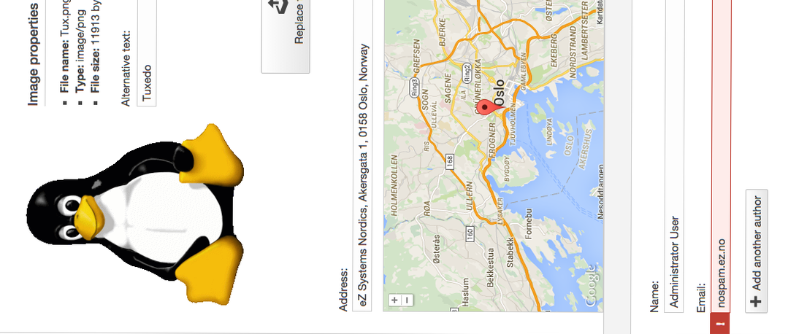
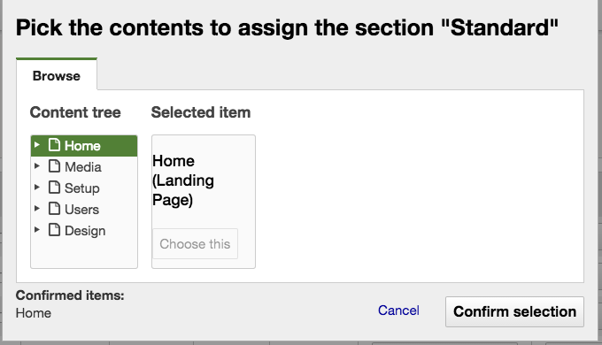
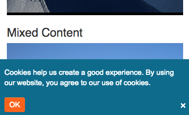

# eZ Platform 15.03 Release notes

## eZ Platform "Alpha2" available for testing

##### 13th May 2015

{width="300" height="128"}

#### Quick links

-   Install
-   Requirements (currently same as eZ Publish Platform 5.4)
-   Upgrading: As this is a alpha release, there is no upgrade instructions yet, this is planned for Beta during the Summer.

-   Download: See [share.ez.no/downloads](http://share.ez.no/downloads/downloads/ez-platform-15.03-alpha), or see *Install* for how to install via composer.

The second alpha release of eZ Platform,15.03, builds upon the [15.01](eZ_Platform_15.01_Release_notes) March release adding additional support for editing- and browsing-capabilities. It also contains several underlying improvements and fixes developed for [5.3.5](https://doc.ez.no/display/TMPA/5.3.5+Release+Notes) and [5.4.2](https://doc.ez.no/display/TMPA/5.4.2+Release+Notes), that has also been released recently.

*Next release is planned to be released beginning of June, and will preview several additional features currently not exposed yet.*

## Highlights

Besides lots of smaller improvements and fixes found bellow, and mentioned above for the 5.x sub release, the main visual changes are: 

### Platform UI Bundle with Universal Discovery Widget

 

<table>
<colgroup>
<col width="50%" />
<col width="50%" />
</colgroup>
<tbody>
<tr class="odd">
<td align="left"></td>
<td align="left">
One important feature in eZ Publish, and also now eZ Platform, is being able to browse for content you want to select. In eZ Platform we call this Universal Discovery Widget, and in this release you can see more or less the completion of first part of this with possibility to select by browsing the tree (location structure): EZP-23893 - UDW : Basic tree Closed

This is used for Relation, Relation List and Section assignment selection so far, and before July release we hope to complete this part with inclusion of EZP-24067 - Sub items widget QA

Future tentatively planned ways to browse for content includes:

<table>
<tbody>
<tr class="odd">
<td align="left">Summary</td>
<td align="left">Updated</td>
<td align="left">P</td>
<td align="left">Status</td>
</tr>
<tr class="even">
<td align="left"><a href="https://jira.ez.no/browse/EZP-24284?src=confmacro">UDW - Search</a></td>
<td align="left">Jun 30, 2016</td>
<td align="left"></td>
<td align="left">Open</td>
</tr>
<tr class="odd">
<td align="left"><a href="https://jira.ez.no/browse/EZP-24285?src=confmacro">UDW - recent content</a></td>
<td align="left">Jun 30, 2016</td>
<td align="left"></td>
<td align="left">Open</td>
</tr>
<tr class="even">
<td align="left"><a href="https://jira.ez.no/browse/EZP-24286?src=confmacro">UDW : Bookmark</a></td>
<td align="left">Jun 30, 2016</td>
<td align="left"></td>
<td align="left">Open</td>
</tr>
<tr class="odd">
<td align="left"><a href="https://jira.ez.no/browse/EZP-24287?src=confmacro">UDW : ID</a></td>
<td align="left">Jun 30, 2016</td>
<td align="left"></td>
<td align="left">Open</td>
</tr>
</tbody>
</table>

4 issues

</td>
</tr>
</tbody>
</table>

### Demo Bundle with privacy cookie banner

|                                                     |                                                                                                                                                                                                                                                                                     |
|-----------------------------------------------------|-------------------------------------------------------------------------------------------------------------------------------------------------------------------------------------------------------------------------------------------------------------------------------------|
| {width="300"} | Available in this release is a new [PrivacyCookieBundle](https://github.com/ezsystems/EzSystemsPrivacyCookieBundle), providing easy access to setup warning and remembering user input for Privacy banners needed to comply with EU directive commonly referred to as "Cookie law". |

### Other notable changes

-   EZP-24015 - Improve Language Switcher flags and logic Closed
-   EZP-23730 - As an editor, I want to see the content of the media fields Closed
-   EZP-23816 - As an editor, I want to be able to fill the Relation field Closed
-   EZP-24213 - FullText stopWordThreshold should be percentage of content count Closed

 

## Changelog

*Changes* (Stories, Improvements and bug fixes) can be found in our issue tracker:  47 issues  *(some are still pending additional documentation changes)*

### Known issues & upcoming features

-   List of issues specifically affecting this release:  19 issues
-   General "Known issues" in *Platform stack* compared to* Legacy*:  8 issues
-   Epics tentatively\* planned for first stable release:  7 issues
-   Epics tentatively\* planned for first LTS release:  0 issue

*'\* Some of these features will not be in the stable releases, the once we first and foremost will aim for having in the release are those mentioned on the [Roadmap](http://ez.no/Blog/What-to-Expect-from-eZ-Studio-and-eZ-Platform).*

## Attachments:

{width="8" height="8"} [Screen Shot 2015-05-12 at 19.16.38 .png](attachments/31429950/31429943.png) (image/png)
{width="8" height="8"} [PrivacyCookieBundle.png](attachments/31429950/31429944.png) (image/png)
{width="8" height="8"} [Screen Shot 2015-05-12 at 11.46.48 .png](attachments/31429950/31429945.png) (image/png)
{width="8" height="8"} [iStock\_000032478246XLarge - banner doc.jpg](attachments/31429950/31429946.jpg) (image/jpeg)
{width="8" height="8"} [Ventoux-Square.jpg](attachments/31429950/31429947.jpg) (image/jpeg)
{width="8" height="8"} [Getting-Started-with-eZ-Publish-Platform.jpg](attachments/31429950/31429948.jpg) (image/jpeg)
{width="8" height="8"} [Platform screenshoot alpha1.gif](attachments/31429950/31429949.gif) (image/gif)

