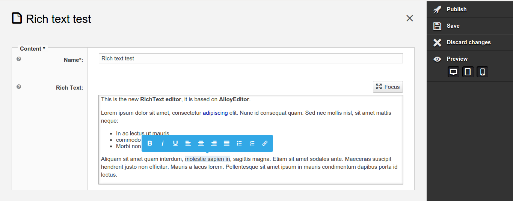
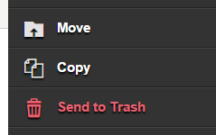
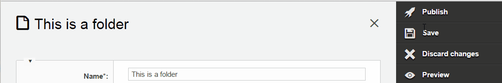

# eZ Platform 15.05 Release notes

# eZ Platform "Alpha3" available for testing



#### Quick links

-   [Installation instructions](https://github.com/ezsystems/ezplatform/blob/v0.9.0/INSTALL.md)
-   Requirements (currently same as eZ Publish Platform 5.4)
-   Upgrading: As this is a alpha release, there is no upgrade instructions yet, this is planned for Beta.

-   Download: See [share.ez.no/downloads](http://share.ez.no/downloads/downloads/ez-platform-15.05-alpha), or see *Install* for how to install via composer.

*July 6th 2015*

The third alpha release of eZ Platform,15.05 builds upon the [15.03](eZ_Platform_15.03_Release_notes) March release adding additional support for editing- and browsing-capabilities. It also contains several underlying improvements and fixes that will be part of the [5.3.6](https://doc.ez.no/display/TMPA/5.3.5+Release+Notes) and [5.4.3](https://doc.ez.no/display/TMPA/5.4.2+Release+Notes) maintenance versions that will be released soon.

# Highlights

Besides lots of smaller improvements and fixes found bellow, and mentioned above for the 5.x sub release, the main changes are: 

## Improved Symfony 2.7/3.0 support


Symfony 2.7 LTS is now fully supported, and no deprecation errors should be thrown anymore. This should also ensure compatibility with the 2.8 and 3.0 releases planned for november this year.

Dynamic settings have been refactored to use the Expression Language instead of fake services.

More info: [Symfony 2.7/3.0 epic](https://jira.ez.no/browse/EZP-24094), [Symfony 2.7 announcement blog post](http://symfony.com/blog/symfony-2-7-0-released)

 

## Content Type administration UI

Content types can now be created or edited from PlatformUI, inside the Admin panel. The feature isn't visually integrated yet, but already covers most FieldTypes. Progress can be followed on the Epic above.

Forms themselves use the [Symfony Forms component](http://symfony.com/doc/current/components/form/introduction.html). The implementation has been done in a distinct package, dedicated to providing Forms for the eZ Repository domain: [Repository Forms](https://github.com/ezsystems/repository-forms).

More info: [Content type management epic](http://jira.ez.no/browse/EZP-24070), [repository-forms on Github](https://github.com/ezsystems/repository-forms), [repository-forms on Packagist](https://packagist.org/packages/ezsystems/repository-forms).

 

 

 

 

{width="433" height="199"}

## Image variations purging


Image variations generated by Imagine can now be purged using the application console. It can either clear all variations, or variations of a particular alias:

```
# Clear all variations of the large and gallery aliases/filters
php ezpublish/console liip:imagine:cache:remove --filters=large --filters=gallery -v
```

Note that this change comes with a modification of the variations storage path. This change will be transparent from a user's perspective, but you may want to purge the existing variations. To do this, you need to [switch to the legacy handler](https://github.com/ezsystems/ezpublish-kernel/blob/cc3f25fa25393e404f5af2806176fa07835721ef/eZ/Bundle/EzPublishCoreBundle/Resources/config/image.yml#L200) by redeclaring the `ezpublish.image_alias.variation_purger` service to `ezpublish.image_alias.variation_purger.legacy_storage_image_file`.

More info: [Technical specifications](https://github.com/ezsystems/ezpublish-kernel/blob/v6.0.0-alpha3/doc/specifications/image/variation_purging.md), [Implementation story](http://jira.ez.no/browse/EZP-23367).

 

## content/download controller for Binary Files

## Downloading of binary file is now natively supported, and doesn't require a legacy fallback anymore.

A new controller and route have been added, and the Image and BinaryFile content field templates have been updated. Permissions are transparently checked during download, and HTTP resume is supported. The Route Reference API, provides facilities to generate the right path from templates, and a valid URI is exposed over REST.

More info: Documentation, [Specificaftions](https://github.com/ezsystems/ezpublish-kernel/blob/master/doc/specifications/proposed/content_download/content_download.md), [Implementation story](https://jira.ez.no/browse/EZP-23550), [Content view module epic](https://jira.ez.no/browse/EZP-24144).

 

{width="433" height="121"}

## Platform UI : move, copy and send content to trash



Thanks to the addition of the Universal Discovery Widget in 2015.03, those functions have been added to PlatformUI.

More info: [Content CRUD UI epic](https://jira.ez.no/browse/EZP-22993) 

 

 

 

 

## Platform UI notifications

Notifications will now be displayed upon certain events in the backoffice.

Each notification is either an information (content was published, location was removed...), or an error. A reusable javascript API makes it easy to re-use the system for your own needs, if any, on PlatformUI. A PHP API has also been added in order to send notifications from the Symfony controllers used to implement some parts of the backoffice.

More info: [UI notifications epic](https://jira.ez.no/browse/EZP-24340)

 



## Rich text editing prototype based on Alloy


A prototype of the WYSWIGYG editor for the RichText FieldType has been added. It is based on Alloy Editor, itself based on CKEditor. 

To see it in action, you need to create a new Content Type with a RichText Field. A perfect opportunity to test the Content Type admin UI.

More info: [Alloy Editor](http://alloyeditor.com/), [RichText editing epic](https://jira.ez.no/browse/EZP-22949), [prototype screencast](https://www.youtube.com/watch?v=o1r44rmYsdY)

**
**

**
**

## Re-usable privacy cookie handling

The [ezsystems/privacy-cookie-bundle](https://packagist.org/packages/ezsystems/privacy-cookie-bundle) package, introduced in the 15.03 release, has been made much more flexible. It now comes with a Factory interface and a Banner value object, so that it is easy to pick the banner's content in different ways.

The built-in implementation uses a configuration file based Factory, allowing you to configure the cookie banner using simple yaml files.

More info: [github repository](http://github.com/ezsystems/EzSystemsPrivacyCookieBundle) 


## Other notable changes

-   Legacy storage engine performances improvements
    -   EZP-24499 - loading Content with many languages & attributes & locations leads to high memory usage Closed
    -   EZP-24539 - Avoid expensive sorting sql when not needed in Search Closed

## Changelog

*Changes* (Stories, Improvements and bug fixes) can be found in our issue tracker:  51 issues  *(some are still pending additional documentation changes)*

### Known issues & upcoming features

List of issues specifically affecting this release:  35 issues

General "Known issues" in *Platform stack* compared to* Legacy*:  8 issues

Epics tentatively\* planned for first stable release:  7 issues

Epics tentatively\* planned for first LTS release:  0 issue

*'\* Some of these features will not be in the stable releases, the once we first and foremost will aim for having in the release are those mentioned on the [Roadmap](http://ez.no/Blog/What-to-Expect-from-eZ-Studio-and-eZ-Platform).*

## Attachments:

{width="8" height="8"} [notifications.gif](attachments/31429968/31429952.gif) (image/gif)
{width="8" height="8"} [privacy cookie.PNG](attachments/31429968/31429953.png) (image/png)
{width="8" height="8"} [move-copy-send to trash.PNG](attachments/31429968/31429954.png) (image/png)
{width="8" height="8"} [content\_download.PNG](attachments/31429968/31429955.png) (image/png)
{width="8" height="8"} [variations purging.PNG](attachments/31429968/31429956.png) (image/png)
{width="8" height="8"} [content type edition.PNG](attachments/31429968/31429957.png) (image/png)
{width="8" height="8"} [symfony\_black\_02.png](attachments/31429968/31429958.png) (image/png)
{width="8" height="8"} [symfony\_black\_03.png](attachments/31429968/31429959.png) (image/png)
{width="8" height="8"} [RichText editor.png](attachments/31429968/31429960.png) (image/png)
{width="8" height="8"} [Ventoux-Square.jpg](attachments/31429968/31429961.jpg) (image/jpeg)
{width="8" height="8"} [Getting-Started-with-eZ-Publish-Platform.jpg](attachments/31429968/31429962.jpg) (image/jpeg)
{width="8" height="8"} [Platform screenshoot alpha1.gif](attachments/31429968/31429963.gif) (image/gif)
{width="8" height="8"} [Screen Shot 2015-05-12 at 19.16.38 .png](attachments/31429968/31429964.png) (image/png)
{width="8" height="8"} [PrivacyCookieBundle.png](attachments/31429968/31429965.png) (image/png)
{width="8" height="8"} [Screen Shot 2015-05-12 at 11.46.48 .png](attachments/31429968/31429966.png) (image/png)
{width="8" height="8"} [iStock\_000032478246XLarge - banner doc.jpg](attachments/31429968/31429967.jpg) (image/jpeg)

