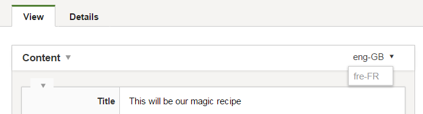
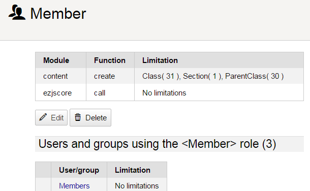

# eZ Platform 15.07 Release notes

# eZ Platform "Alpha4" available for testing

#### Quick links

-   [Installation instructions](https://github.com/ezsystems/ezplatform/blob/v0.10.0/INSTALL.md)
-   Requirements (currently same as eZ Publish Platform 5.4)
-   Upgrading: As this is a alpha release, there is no upgrade instructions yet, this is planned for Beta.

-   Download: See [share.ez.no/downloads](http://share.ez.no/downloads/downloads/ez-platform-15.07), or see *Install* for how to install via composer.

The fourth alpha release of eZ Platform,15.07, builds upon the [15.05](eZ_Platform_15.05_Release_notes) July release.  It most noticeably adds support for Solr, as well as many UI enhancements and additions. It also contains most improvements and fixes that are part of the 5.4.3 and 5.4.4 enterprise releases.

# Highlights

With the many [improvements and fixes](#eZPlatform15.07Releasenotes-changelog) listed at the bottom, the main changes are:

## RichText editor improvements

-   The active element is now highlighted ([EZP-24769](https://jira.ez.no/browse/EZP-24769))
-   The contextual toolbar now works on the following elements:
    -   Headings: change level, or remove heading ([EZP-24725](https://jira.ez.no/browse/EZP-24725))
    -   Paragraphs: change alignment
-   The native Alloy Editor "append content" can be used to add a new heading or an embed element ([EZP-24768](https://jira.ez.no/browse/EZP-24768))

 

## Content language display selection

On Content that has translations, a dropdown will now list the available languages. Selecting one of them will display the Content in that language instead. The Edit button will now use the currently active translation.

Stories: [EZP-23765](https://jira.ez.no/browse/EZP-23765), [EZP-24549](https://jira.ez.no/browse/EZP-24549)

{width="427"}

## Translate content

When there are multiple languages configured, translations can be added and edited.

Story: [EZP-23766](https://jira.ez.no/browse/EZP-23766)

 

{height="250"}

## Roles management UI prototype

An UI to manage Roles and Policies has been started, and can be previewed.

It is currently limited to listing, creating and deleting roles, without policy management, even though policies can already be viewed.

Epic: [EZP-24071](https://jira.ez.no/browse/EZP-24071)

As can be seen in the epic, this feature is being worked on, and will quickly evolve over the next weeks.

{width="427"}

## Other UI changes

-   **Details of locations** can now be viewed from the backoffice: content id, creator, modification date, remote id... ([EZP-24512](https://jira.ez.no/browse/EZP-24512))
-   **Interactive confirmation messages** as well as **notifications** can now be triggered by server side admin pages ([EZP-24652](https://jira.ez.no/browse/EZP-24652), [EZP-24536](https://jira.ez.no/browse/EZP-24536))
-   **AlloyEditor** has been updated to 0.5.x ([EZP-24712](https://jira.ez.no/browse/EZP-24712))
-   **Section Management** has been reworked, and moved from [ezsystems/platform-ui-bundle](https://github.com/ezsystems/PlaformUIBundle) to [ezsystems/repository-forms](https://github.com/ezsystems/repository-forms) ([EZP-24380](https://jira.ez.no/browse/EZP-24380))
-   Configuration can now be sent to the PlatformUI JS app ([EZP-24129](https://jira.ez.no/browse/EZP-24129))

## Native Solr support

Until now, the `SearchService` was using the Legacy database search implementation. It was quite limited, and performed very badly. The Solr implementation has been worked on since last summer, and finally made it into the product.

After [configuration and setup](https://doc.ez.no/display/EZP/Solr+Search+Engine+Bundle#SolrSearchEngineBundle-HowtosetupSolrSearchengine), Solr will be used by the SearchService for all of your Location, Content and ContentInfo queries. It has very advanced multilanguage capabilities, and will offer great performances whenever you need to grab Content or Locations from the Repository. 

Note that as it is lifts off many limitations, this feature will also be made available to Enterprise customers eZ Publish Platform 5.4 via a specific update.

Documentation: [https://doc.ez.no/display/EZP/Solr+Search+Engine+Bundle
](https://doc.ez.no/display/EZP/Solr+Search+Engine+Bundle)Source: ezsystems/ezplatform-solr-search-engineEpic: [EZP-22944](https://jira.ez.no/browse/EZP-22944)

{width="427"}

## Other Platform changes

-   Locations returned by the REST API will now **include the ContentInfo**[.](https://jira.ez.no/browse/EZP-24672) This should avoid quite a few calls only to get the name, or basic info about the Location's Content ([EZP-24672](https://jira.ez.no/browse/EZP-24672))
-   The **REST API** will now let you **search for Location** in addition to Content. While the existing resource remains valid, note that `/views` should be used instead of `/content/views` ([EZP-24671](https://jira.ez.no/browse/EZP-24671))

## Changelog

*Changes* (Stories, Improvements and bug fixes) can be found in our issue tracker:  67 issues  *(some are still pending additional documentation changes)*

### Known issues & upcoming features

List of issues specifically affecting this release:  35 issues

General "Known issues" in *Platform stack* compared to* Legacy*:  8 issues

Epics tentatively\* planned for first stable release:  7 issues

Epics tentatively\* planned for first LTS release:  0 issue

*'\* Some of these features will not be in the stable releases, the once we first and foremost will aim for having in the release are those mentioned on the [Roadmap](http://ez.no/Blog/What-to-Expect-from-eZ-Studio-and-eZ-Platform).*

## Attachments:

{width="8" height="8"} [Solr\_Logo\_on\_white.png](attachments/31429990/31429970.png) (image/png)
{width="8" height="8"} [Platform 2015.07 - roles UI.PNG](attachments/31429990/31429971.png) (image/png)
{width="8" height="8"} [Platform 2015.07 - choose translation.PNG](attachments/31429990/31429972.png) (image/png)
{width="8" height="8"} [eZ Platform 2015.07 - add translation.gif](attachments/31429990/31429973.gif) (image/gif)
{width="8" height="8"} [privacy cookie.PNG](attachments/31429990/31429974.png) (image/png)
{width="8" height="8"} [move-copy-send to trash.PNG](attachments/31429990/31429975.png) (image/png)
{width="8" height="8"} [content\_download.PNG](attachments/31429990/31429976.png) (image/png)
{width="8" height="8"} [variations purging.PNG](attachments/31429990/31429977.png) (image/png)
{width="8" height="8"} [content type edition.PNG](attachments/31429990/31429978.png) (image/png)
{width="8" height="8"} [symfony\_black\_02.png](attachments/31429990/31429979.png) (image/png)
{width="8" height="8"} [symfony\_black\_03.png](attachments/31429990/31429980.png) (image/png)
{width="8" height="8"} [RichText editor.png](attachments/31429990/31429981.png) (image/png)
{width="8" height="8"} [Ventoux-Square.jpg](attachments/31429990/31429982.jpg) (image/jpeg)
{width="8" height="8"} [Getting-Started-with-eZ-Publish-Platform.jpg](attachments/31429990/31429983.jpg) (image/jpeg)
{width="8" height="8"} [Platform screenshoot alpha1.gif](attachments/31429990/31429984.gif) (image/gif)
{width="8" height="8"} [Screen Shot 2015-05-12 at 19.16.38 .png](attachments/31429990/31429985.png) (image/png)
{width="8" height="8"} [PrivacyCookieBundle.png](attachments/31429990/31429986.png) (image/png)
{width="8" height="8"} [Screen Shot 2015-05-12 at 11.46.48 .png](attachments/31429990/31429987.png) (image/png)
{width="8" height="8"} [iStock\_000032478246XLarge - banner doc.jpg](attachments/31429990/31429988.jpg) (image/jpeg)
{width="8" height="8"} [notifications.gif](attachments/31429990/31429989.gif) (image/gif)

