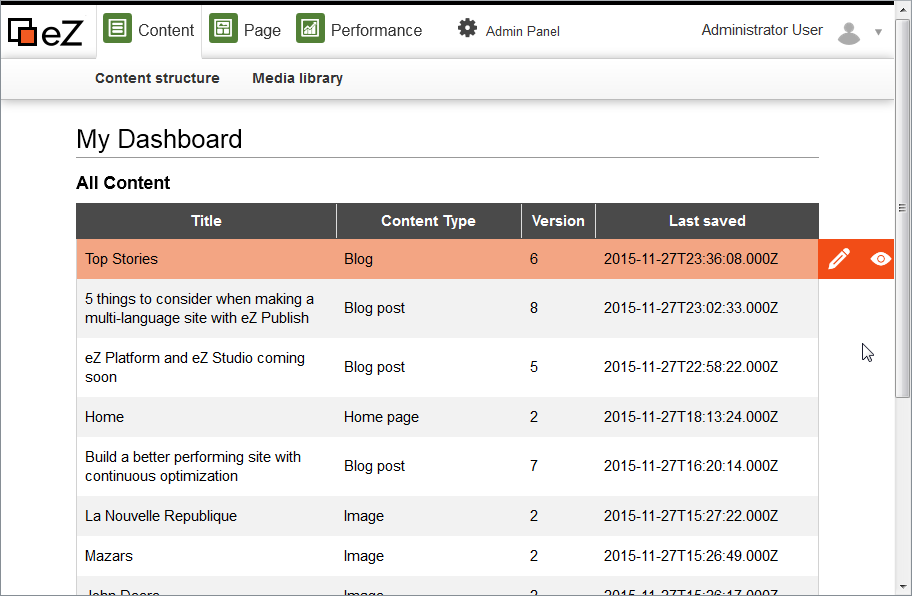
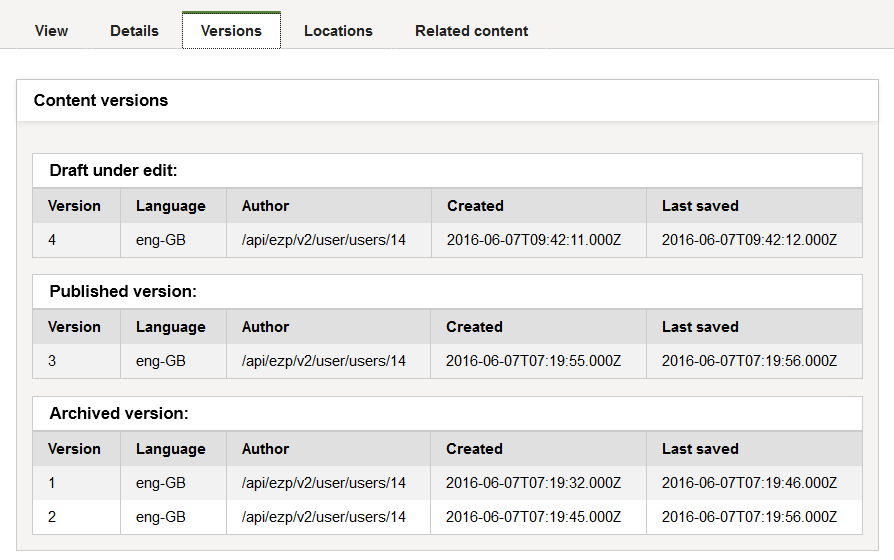
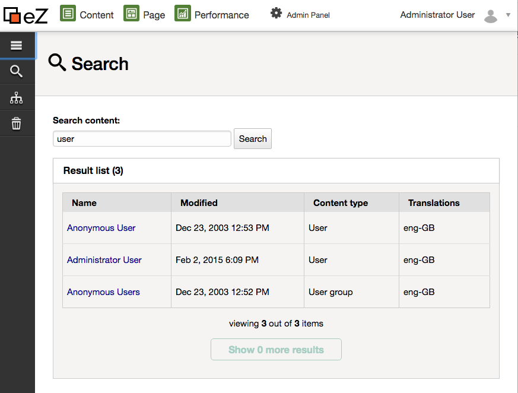
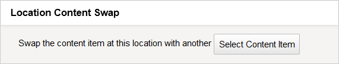
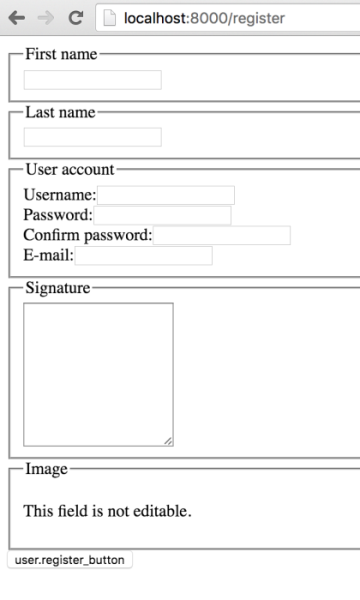

# eZ Platform v1.4.0 Release notes

The v1.4.0 release of eZ Platform is available as of 30 June 2016.

For the release notes of the corresponding eZ Studio release, see [eZ Enterprise v1.4 Release notes](eZ_Enterprise_v1.4_Release_notes).

## Quick links

-   [Installation instructions](Step_1:_Installation)
-   Requirements
-   Download

## Changes since v1.3

For list of issues fixed in v1.4.0 see our issue tracker, below is a list of notable bugs/features/enhancements done in the release.

### Content on the fly

It is now possible to create content on the fly, during the editing process. You no longer need to be in the View mode to create a new Content item. Instead you can do it from the Universal Discovery Widget, for example when embedding content in the Online Editor, or when choosing an image linked to a different Content item.

{height="400"}

This feature is provided as a preview in this release, available from a separate bundle: `EzContentOnTheFlyBundle`

### Dashboard

When logging in to the app you are now greeted with a Dashboard which you can use to quickly view and start editing the most important content. Content in the Dashboard is presented in three blocks:

-   **All Content:** Last Content items that have been modified.
-   **My Drafts:** All your current Content item drafts.
-   **My Content:** All Content items that you have modified.

{width="650"}

### Managing Content item versions

In the View mode you now have a new tab: **Versions**. It lists all versions of the current Content item, including archived and published versions, as well as drafts. You can view any version, edit an existing draft, delete versions or create a new draft from an existing version.

{width="650"}

### Full text search

Full text search is now available, accessible in the Universal Discovery Widget (in the **Search** tab), and in the discovery bar (on the left on the screen).

{height="400"}

This feature is provided as a preview in this release, available from a separate bundle: `PlatformUISearchPrototypeBundle`

Needs Solr for now

Full text indexing is currently only working with Solr search engine. To follow status for LegacySearchEngine (SQL) see EZP-25088 Closed

### Location swap

It is now possible to swap two Content items in their Locations. You can do it in the **Location** tab of any Content item.

Thanks go to Carlos Revillo for the contribution.

{width="400"}

### User registration

Registering new users is now available through a `/register` route.

{width="300"}

### User-Generated Content improved

User-generated content, accessible through the ` content/create/nodraft` route, now covers more Field Types, including Selection and Checkbox, as needed by User Registration.

See [User Generated Content](User_Generated_Content) for more information.

### Query Controller

Added a Query controller which makes it easier to run a repository query and display the results in a template, with built-in "children" query controller you will no longer need to create own controllers whenever you need to simply list up children of a location.

See the [Query controller page](Content-Rendering_31429679.html#ContentRendering-Querycontroller) for more information.

{.image-right height="150"}

### Docker Tools Beta

In this release we are starting to share tools to help you use Docker with eZ Platform. What we share today has gone through several iterations to try to become as simple as possible. It uses plain Docker and Docker Compose to avoid having to learn anything specific with these tools, and it uses official docker images to take advantage of continued innovation by Docker Inc. and the ecosystem.

Further reading: [Docker Tools](Docker_Tools)

## Updating

To update to this version, follow the [Updating eZ Platform](Updating_eZ_Platform) guide and use v1.4.0 as `<version>`.

 

## Packages versions in this release

| Package Name                        | 1.4.0 version |
|-------------------------------------|---------------|
| behatbundle                         | 6.3.0         |
| ez-support-tools                    | 0.1.0.1       |
| ezplatform-solr-search-engine       | 1.0.3         |
| ezpublish-kernel                    | 6.4.0         |
| platform-ui-assets-bundle           | 2.1.0         |
| repository-forms                    | 1.3.0         |
| ezplatform-xmltext-fieldtype        | 1.1.2         |
| platform-ui-bundle                  | 1.4.0         |
| comments-bundle                     | 6.0.0         |
| content-on-the-fly-prototype-bundle | 0.1.1         |
| platform-ui-search-prototype-bundle | 0.1.3         |

#### In this topic:

-   [Quick links](#eZPlatformv1.4.0Releasenotes-Quicklinks)
-   [Changes since v1.3](#eZPlatformv1.4.0Releasenotes-Changessincev1.3)
    -   [Content on the fly](#eZPlatformv1.4.0Releasenotes-Contentonthefly)
    -   [Dashboard](#eZPlatformv1.4.0Releasenotes-Dashboard)
    -   [Managing Content item versions](#eZPlatformv1.4.0Releasenotes-ManagingContentitemversions)
    -   [Full text search](#eZPlatformv1.4.0Releasenotes-Fulltextsearch)
    -   [Location swap](#eZPlatformv1.4.0Releasenotes-Locationswap)
    -   [User registration](#eZPlatformv1.4.0Releasenotes-Userregistration)
    -   [User-Generated Content improved](#eZPlatformv1.4.0Releasenotes-User-GeneratedContentimproved)
    -   [Query Controller](#eZPlatformv1.4.0Releasenotes-QueryController)
    -   [Docker Tools Beta](#eZPlatformv1.4.0Releasenotes-DockerToolsBeta)
-   [Updating](#eZPlatformv1.4.0Releasenotes-Updating)
-   [Packages versions in this release](#eZPlatformv1.4.0Releasenotes-Packagesversionsinthisrelease)

## Attachments:

{width="8" height="8"} [user\_registration\_form.png](attachments/32113421/32113422.png) (image/png)
{width="8" height="8"} [location\_swap.png](attachments/32113421/32113420.png) (image/png)
{width="8" height="8"} [user\_registration\_form.png](attachments/32113421/32113419.png) (image/png)
{width="8" height="8"} [dashboard.png](attachments/32113421/32113446.png) (image/png)
{width="8" height="8"} [versions\_tab.png](attachments/32113421/32113448.png) (image/png)
{width="8" height="8"} [docker-logo.png](attachments/32113421/32113469.png) (image/png)
{width="8" height="8"} [UI Simple Fulltext Search.png](attachments/32113421/32113513.png) (image/png)

