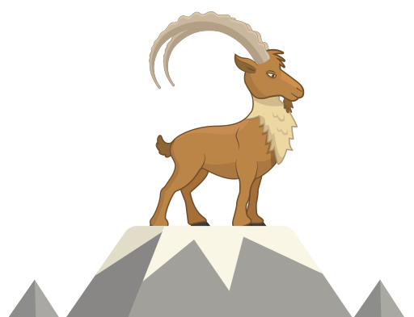

# Get Started with eZ Platform

# Quickstart with eZ Platform

**Before you begin: [Requirements & Configuration](../DEVELOPER/Step_0:_Requirements_&_System_Configuration)**

**Getting things set up: [Installation](https://doc.ez.no/display/DEVELOPER/Step+1%3A+Installation)**

**Learning eZ Platform: [What's Next](https://doc.ez.no/display/DEVELOPER/Step+2%3A+Going+Deeper)**

**
**

#### Transitioning to eZ Platform

If you've worked with **eZ Publish** (our legacy product) in the past, see [Migration from eZ Publish](Migration_from_eZ_Publish), and a [Feature Comparison](https://doc.ez.no/display/MAIN/Transitioning+from+eZ+Publish+to+eZ+Platform+and+eZ+Studio%3A+Feature+Comparison) between eZ Publish (legacy) and eZ Platform (current).

If you've worked with **other CMS's** before, see [Migrating to eZ Platform](../DEVELOPER/Migrating_to_eZ_Platform_-_Follow_the_Ibex!).

 

 

{.image-center}

 

## Attachments:

{width="8" height="8"} [ibex-mountain-small.png](attachments/31429520/32866977.png) (image/png)

