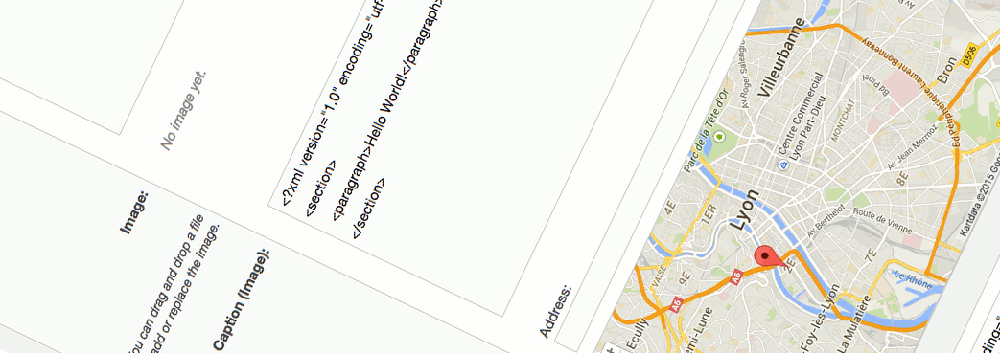

# eZ Platform 15.01 Release notes

## Introducing eZ Platform, "Alpha1"

##### 4th March 2015

<table>
<colgroup>
<col width="100%" />
</colgroup>
<tbody>
<tr class="odd">
<td align="left"></td>
</tr>
<tr class="even">
<td align="left">
Welcome to the first release of eZ Platform, 15.01 serves two purposes: As first alpha release of eZ Platform, and also as eZ Publish Community edition v2015.01 by installing optional legacy packages. Further information about eZ Platform (and eZ Studio), and what you can expect, can be found in <a href="http://ez.no/Blog/What-to-Expect-from-eZ-Studio-and-eZ-Platform">recent blog post on ez.no</a>.

<h4 id="eZPlatform15.01Releasenotes-Quicklinks">Quick links</h4>
<ul>
<li>Install</li>
<li>Requirements (currently same as eZ Publish Platform 5.4)</li>
<li>
Upgrading: As this is a alpha release, there is no upgrade instructions yet, this will be available starting with the beta, currently scheduled for May
</li>
<li>
Download: <em>Download</em> from <a href="http://share.ez.no/downloads/downloads/ez-platform-15.01-alpha">share.ez.no/downloads</a> or see <em>Install</em> for how to install via composer
</li>
</ul></td>
</tr>
</tbody>
</table>

## Highlights

### Legacy is "gone"

This major milestone, and is what makes the first release of eZ Platform possible. This is further covered in [Core Development blog post](http://share.ez.no/blogs/core-development-team/farewell-ez-publish-legacy-welcome-ez-platform). But in short: the related libraries, services and configuration have been externalized to a new package: [ezsystems/legacy-bridge](https://packagist.org/packages/ezsystems/legacy-bridge). And since the eZ Platform is still in alpha, ezpublish-legacy and legacy-bridge v2015.01 can still easily be installed.

### Ships with Platform UI Bundle v0.5

Platform UI, revealed last july, has received its first tag: v0.5. It is pre-installed and pre-configured in this release, and it can be accessed via /shell.

See blog post from December for further information about the new User Interface.

### Prototype of native installer

Since we can't rely on legacy anymore, prototype of a native installer has been added, as a console script: `ezpublish/console ezplatform:install`. It is meant to be very simple, fast, easy to automate, and easy to extend.

## Changelog

*Changes* (Stories, Improvements and bug fixes) can be found in our issue tracker:  87 issues

### Known issues & upcoming features

-   List of issues specifically affecting this release:  42 issues
-   General "Known issues" in *Platform stack* compared to* Legacy*:  8 issues
-   Epics currently planned for first stable release:  7 issues
-   Epics currently planned for first LTS release:  0 issue

 

## Attachments:

{width="8" height="8"} [Platform screenshoot alpha1.gif](attachments/31429941/31429937.gif) (image/gif)
{width="8" height="8"} [iStock\_000032478246XLarge - banner doc.jpg](attachments/31429941/31429938.jpg) (image/jpeg)
{width="8" height="8"} [Ventoux-Square.jpg](attachments/31429941/31429939.jpg) (image/jpeg)
{width="8" height="8"} [Getting-Started-with-eZ-Publish-Platform.jpg](attachments/31429941/31429940.jpg) (image/jpeg)

