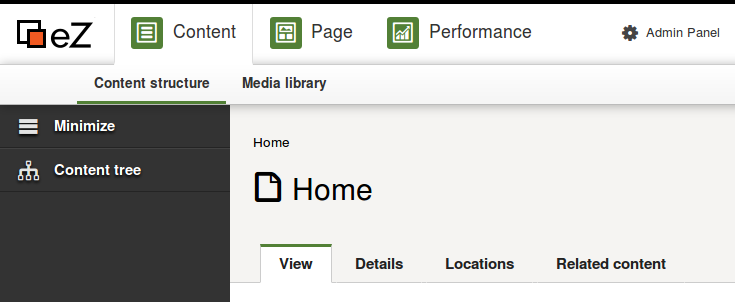

# eZ Platform 15.09 Release notes

# eZ Platform beta now available for testing

#### Quick links

-   [Installation instructions](https://github.com/ezsystems/ezplatform/blob/release-2015.09.01/INSTALL.md)
-   Requirements
-   Download: See [share.ez.no/downloads](http://share.ez.no/downloads/downloads/ez-platform-15.09), or see *Install* for how to install via composer.

The fifth release of eZ Platform, 15.09, is the first in "beta" stability. It builds upon the [15.07](eZ_Platform_15.07_Release_notes) September alpha release. It most notably provides many new UI features, both in this download and continues to provide a few more additional UI features during it's beta period until end of month.

# Highlights

Along with the [improvements and fixes](#eZPlatform15.09Releasenotes-changelog) listed at the bottom, the most notable changes are the sub-items list in PlatformUI, location & relation tabs, and policies support in custom bundles.

## Platform UI sub-items list

Sub-items will now be listed in PlatformUI. This is a minimum viable feature. In further releases, this will be expanded to improve UX with ability to change sub-items views and ability to easily add subitems. For now the sub-items list view enables repository browsing via the content view. 

Story: [EZP-24824](https://jira.ez.no/browse/EZP-24824)

## Platform UI languages improvements

The list of content languages configured in the system is now correctly passed on to the UI ([EZP-24865](https://jira.ez.no/browse/EZP-24865)), avoiding errors on language selection. 

The language of the edited content can now be selected during editing ([EZP-23768](https://jira.ez.no/browse/EZP-23768))

## New PlatformUI content tabs

Dedicated tabs have been added for relations ([EZP-24509](https://jira.ez.no/browse/EZP-24509)) and locations ([EZP-24815](https://jira.ez.no/browse/EZP-24815)) of any Content. Both will list a content's relations and locations.

The location tab also allows to manage (add, remove, hide/unhide) locations, as well as select a new main location (currently not working).

{width="450"}

## Other UI improvements

 

-   Content type groups can be managed ([EZP-24454](https://jira.ez.no/browse/EZP-24454))
-   Content types can be removed ([EZP-24453](https://jira.ez.no/browse/EZP-24453))
-   Users other than the admin can now login to Platform UI ([EZP-24753](https://jira.ez.no/browse/EZP-24753))
-   Limited user accounts management has been implemented
-   PJAX error messages are now correctly displayed ([EZP-24787](https://jira.ez.no/browse/EZP-24787))

 

{width="450"}

## Custom repository policies support

Bundles can now declare custom modules, policies and limitations.

Links: [documentation](https://github.com/ezsystems/ezpublish-kernel/blob/master/doc/specifications/security/permissions/policies_extensibility.md), [EZP-24862](https://jira.ez.no/browse/EZP-24862).

{width="450"}

## Repository and Platform improvements

-   Solr support for fullText location search ([EZP-24802](https://jira.ez.no/browse/EZP-24802))
-   ezcontentobject\_attribute stores always available flag to all fields
-   Float Fields now accepts integers ([EZP-24038](https://jira.ez.no/browse/EZP-24038))
-   An ancestor Search criterion has been added ([EZP-24804](https://jira.ez.no/browse/EZP-24804))
-   REST: users can be filtered by email and login ([EZP-24820](https://jira.ez.no/browse/EZP-24820))
-   Repository exceptions can be translated ([EZP-24793](https://jira.ez.no/browse/EZP-24793))
-   Bundles can now expose custom policies that can be checked via the repository ([EZP-24862](https://jira.ez.no/browse/EZP-24862))

 

## Changelog

*Changes* (Stories, Improvements and bug fixes) can be found in our issue tracker:  67 issues  *(some are still pending additional documentation changes)*

### Known issues & upcoming features

List of issues specifically affecting this release:  35 issues

General "Known issues" in *Platform stack* compared to* Legacy*:  8 issues

Epics tentatively\* planned for first stable release:  7 issues

Epics tentatively\* planned for first LTS release:  0 issue

*'\* Some of these features will not be in the stable releases, the once we first and foremost will aim for having in the release are those mentioned on the [Roadmap](http://ez.no/Blog/What-to-Expect-from-eZ-Studio-and-eZ-Platform).*

 

## Attachments:

{width="8" height="8"} [platform-custom-policies.png](attachments/31430041/31430017.png) (image/png)
{width="8" height="8"} [locations\_tab.png](attachments/31430041/31430018.png) (image/png)
{width="8" height="8"} [PlatformUI-navigation-bar.png](attachments/31430041/31430019.png) (image/png)
{width="8" height="8"} [Please Help.jpg](attachments/31430041/31430020.jpg) (image/jpeg)
{width="8" height="8"} [privacy cookie.PNG](attachments/31430041/31430021.png) (image/png)
{width="8" height="8"} [move-copy-send to trash.PNG](attachments/31430041/31430022.png) (image/png)
{width="8" height="8"} [content\_download.PNG](attachments/31430041/31430023.png) (image/png)
{width="8" height="8"} [variations purging.PNG](attachments/31430041/31430024.png) (image/png)
{width="8" height="8"} [content type edition.PNG](attachments/31430041/31430025.png) (image/png)
{width="8" height="8"} [symfony\_black\_02.png](attachments/31430041/31430026.png) (image/png)
{width="8" height="8"} [symfony\_black\_03.png](attachments/31430041/31430027.png) (image/png)
{width="8" height="8"} [RichText editor.png](attachments/31430041/31430028.png) (image/png)
{width="8" height="8"} [Ventoux-Square.jpg](attachments/31430041/31430029.jpg) (image/jpeg)
{width="8" height="8"} [Getting-Started-with-eZ-Publish-Platform.jpg](attachments/31430041/31430030.jpg) (image/jpeg)
{width="8" height="8"} [Platform screenshoot alpha1.gif](attachments/31430041/31430031.gif) (image/gif)
{width="8" height="8"} [Screen Shot 2015-05-12 at 19.16.38 .png](attachments/31430041/31430032.png) (image/png)
{width="8" height="8"} [PrivacyCookieBundle.png](attachments/31430041/31430033.png) (image/png)
{width="8" height="8"} [Screen Shot 2015-05-12 at 11.46.48 .png](attachments/31430041/31430034.png) (image/png)
{width="8" height="8"} [iStock\_000032478246XLarge - banner doc.jpg](attachments/31430041/31430035.jpg) (image/jpeg)
{width="8" height="8"} [notifications.gif](attachments/31430041/31430036.gif) (image/gif)
{width="8" height="8"} [Solr\_Logo\_on\_white.png](attachments/31430041/31430037.png) (image/png)
{width="8" height="8"} [Platform 2015.07 - roles UI.PNG](attachments/31430041/31430038.png) (image/png)
{width="8" height="8"} [Platform 2015.07 - choose translation.PNG](attachments/31430041/31430039.png) (image/png)
{width="8" height="8"} [eZ Platform 2015.07 - add translation.gif](attachments/31430041/31430040.gif) (image/gif)

