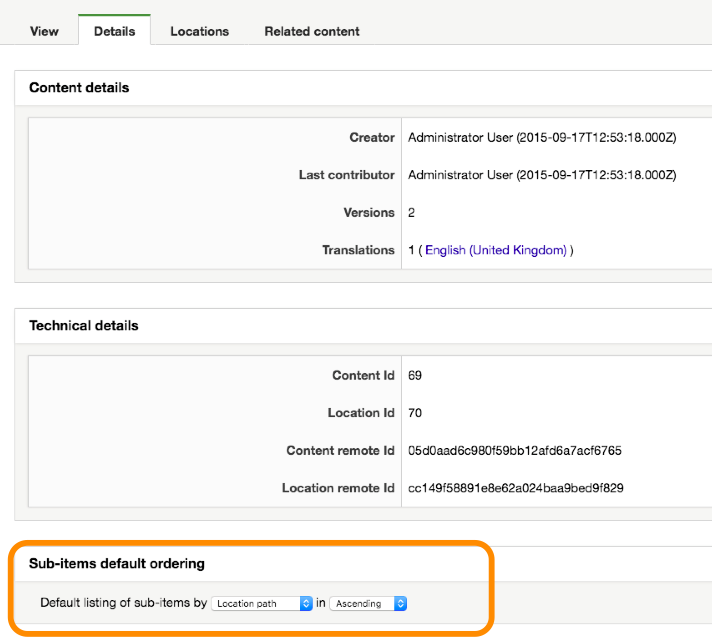
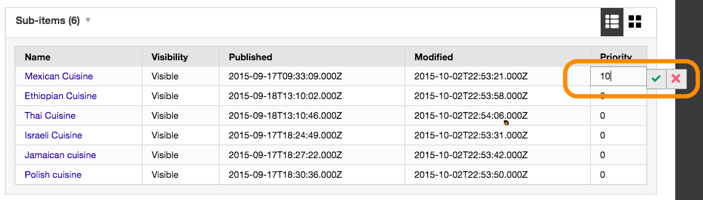
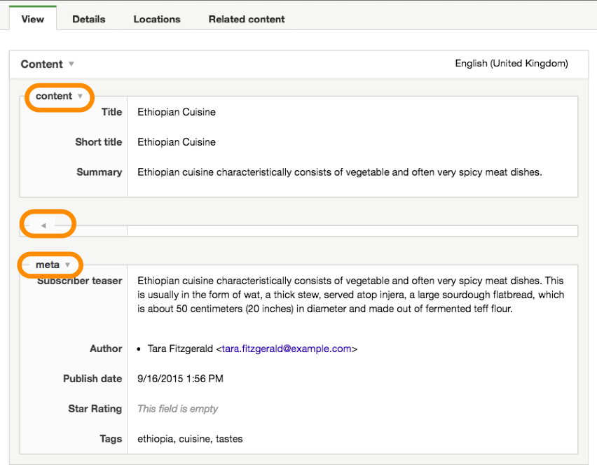
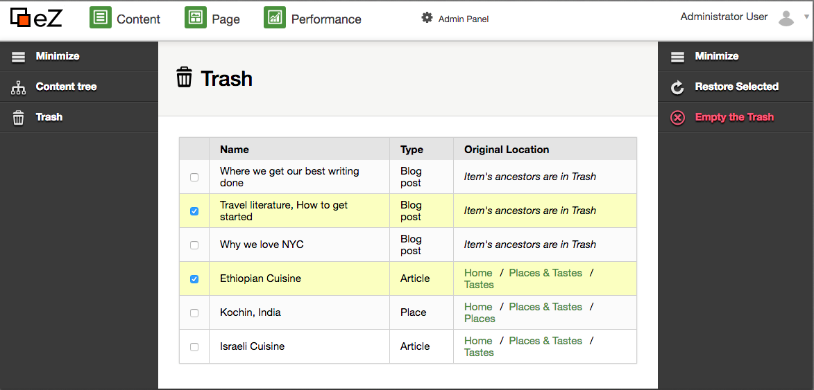

# eZ Platform 2016.04 Release notes

-   [Quick links](#eZPlatform2016.04Releasenotes-Quicklinks)
-   [Changes since 16.02](#eZPlatform2016.04Releasenotes-Changessince16.02)
    -   [Managing sub-items](#eZPlatform2016.04Releasenotes-Managingsub-items)
    -   [Field category support](#eZPlatform2016.04Releasenotes-Fieldcategorysupport)
    -   [Name pattern support for Relation, Relation List and Selection Field Types](#eZPlatform2016.04Releasenotes-NamepatternsupportforRelation,RelationListandSelectionFieldTypes)
    -   [Improved system information admin panel](#eZPlatform2016.04Releasenotes-Improvedsysteminformationadminpanel)
    -   [Improved trash management](#eZPlatform2016.04Releasenotes-Improvedtrashmanagement)
    -   [Pagelayout setting](#eZPlatform2016.04Releasenotes-Pagelayoutsetting)
    -   [Grid sub-items view](#eZPlatform2016.04Releasenotes-Gridsub-itemsview)
-   [Documentation and developer ressources](#eZPlatform2016.04Releasenotes-Documentationanddeveloperressources)
-   [Updating](#eZPlatform2016.04Releasenotes-Updating)

The 16.04 release of eZ Platform is available as of April 28th, 2016.
The semantic version of this release is v1.3.0.

For the release notes of the corresponding eZ Studio release, see [eZ Studio 2016.04 Release notes](eZ_Studio_2016.04_Release_notes)

## Quick links

-   [Installation instructions](https://doc.ez.no/display/TECHDOC/Installation)
-   Requirements
-   Download: See <http://share.ez.no/downloads/downloads/ez-platform-1.3.0>

## Changes since 16.02

See our issue tracker for the list of issues fixed in v1.3.0 (16.04). Below is a list of notable bugs/features/enhancements done in the release.

### Managing sub-items

It's now possible to define ordering criterias for sub-items. It's also possible to set priorities for sub-items. This feature was started with 16.02 but was not fully completed and finally landed in 16.04. Doing this, we also simplified the set of criterias available to the editor.

 

| {width="277" height="250"} | {height="150"} |
|------------------------------------------------------------------|------------------------------------------------------|

[More about the ordering of sub-items](https://jira.ez.no/browse/EZP-25351)

### Field category support

Fields can now be assigned to a category from the Content Type management UI, again making it possible to organize fields for editors in relevant categories.

{width="313" height="250"}

### Name pattern support for Relation, Relation List and Selection Field Types

The Relation and Selection Field Types can now be used to generate content names and URL aliases. This improvement comes with improvements to the API and SPI layer, making it easier to use complex field data to generate a title or url slug.

[More about improved getName() support](http://jira.ez.no/browse/EZP-25303), and for techncial details, for now have a look at [the pull request](https://github.com/ezsystems/ezpublish-kernel/pull/1605).

### Improved system information admin panel

The system information panel in Platform UI has been improved, and reimplemented in a new package, [ezsystems/ez-support-tools](http://github.com/ezsystems/ez-support-tools). This change will make it easier to add custom panels to the UI, or customize existing ones.

[More about improved system information](https://jira.ez.no/browse/EZP-25514)

### Improved trash management

Items that were trashed can now be restored. Trash can be empty, permanently deleting items in the trash.

The user interface introduced a more contextual right action bar for that purpose.

{height="250"}

[More about trash management](https://jira.ez.no/browse/EZP-25305)

### Pagelayout setting

A global pagelayout template can now be defined using siteaccess aware settings:

```
ezpublish:
  system:
    default:
      pagelayout: "pagelayout.html.twig" # app/Resources/views/pagelayout.html.twig
```

This setting will be used by the default content view templates. It is recommended that you also use it in your own templates, so that the site's layout management is centralized. Examples can be found in the [eZ Platform demo templates](https://github.com/ezsystems/ezplatform-demo/blob/master/app/Resources/views/full/blog.html.twig#L1).

Thanks go to Carlos Revillo for the contribution.

### Grid sub-items view

A grid sub-items view has been introduced in PlatformUI. It displays items as blocks, with a large icon, and can be toggled from buttons on the top left corner of the sub-items view.

As of the 16.04 release, the feature is only being introduced, and the icon is identical for all elements. This will change in the future, as can be seen in the [JIRA sub-items epic](https://jira.ez.no/browse/EZP-25350).

More importantly, this has been done to make it possible to developers to extend the user interface in this way. By default, eZ Platform will provide a list view and a grid view but developer will then be able to add their own views for specific context, content type or sections that might have specific business logic.

## Documentation and developer ressources

During the 2016.04 release, we put work into also improving developer resources. [Doc.ez.no](http://doc.ez.no) has been improved continuously throughout the release, and our [beginner tutorial](https://doc.ez.no/display/TECHDOC/Beginner+Tutorial) for developer as well. We will keep working on those ressources during further releases. Please don't hesitate to send feedback.

## Updating

To update to this version, follow the [Updating eZ Platform](Updating_eZ_Platform) guide and use **v1.3.0** as version.

## Attachments:

{width="8" height="8"} [Trash Management.png](attachments/31431643/31431639.png) (image/png)
{width="8" height="8"} [field categories.png](attachments/31431643/31431640.png) (image/png)
{width="8" height="8"} [setting priorities.png](attachments/31431643/31431641.png) (image/png)
{width="8" height="8"} [sub-items ordering.png](attachments/31431643/31431642.png) (image/png)

